# S1 - Construcción de un servicio base para un sistema distribuido

*Por: Angel Sullon Macalupu @asullom - 2026*

## 1. Introducción

Tiempo: 20 min.

### 1.1 Presentación de la sesión

Esta sesión abre la Unidad 1 del proyecto del curso: construye el primer microservicio del sistema, bien delimitado, persistente, observable y escalable. Con él quedan establecidas las convenciones (estructura de capas, ejecución DEV/PROD local, trazabilidad) que se repetirán en cada microservicio posterior del proyecto. El porqué de migrar hacia microservicios se explica en 1.6, a partir del caso de la plataforma de comercio electrónico — esta sesión construye solo el primer paso de ese camino, no el sistema completo.

### 1.2 Índice

1. Arquitectura de un microservicio: responsabilidad única y capas internas.
2. Persistencia: PostgreSQL y migraciones con Flyway.
3. Ejecución reproducible y observable en DEV y escalamiento horizontal (PROD local con Docker, opcional).

### 1.3 Propósito de aprendizaje

Al concluir la clase, estarás en condiciones de:

- **Construir e implementar** un microservicio stateless con API REST, persistencia en PostgreSQL, validación de entradas, documentación de endpoints con Swagger, verificación de salud con Actuator y ejecución reproducible en desarrollo (opcionalmente también en producción local con Docker).

### 1.4 Producto de sesión

`pagatu-catalogo-ms` funcional con CRUD de categorías y de productos, ejecutable en DEV con Maven Wrapper con múltiples instancias en paralelo, PostgreSQL, Swagger, Actuator, README operativo y pruebas por shell. De forma opcional, también ejecutable en producción local con Docker.

### 1.5 Metodología

**Tabla 1. Metodología de la sesión**

| Actividades a Realizar en el Periodo | Orientaciones generales (Orientaciones Metodológicas) | Material de estudio recomendado |
|---|---|---|
| Revisión previa individual | Leer el sílabo de la Unidad 1 y el caso de la plataforma de comercio electrónico (ver 1.6). Trabajo individual, antes de clase; preparar el entorno local (Java 21, Docker) si aún no está listo. | Sílabo del curso Unidad 1, guía de sesión (MkDocs), plataforma UPeU. |
| Clase presencial | Construcción guiada de `pagatu-catalogo-ms`: entidad, CRUD, PostgreSQL, Flyway, Swagger, Actuator y filtro de trazabilidad. Trabajo individual, siguiendo al docente paso a paso; consulta inmediata ante errores de arranque o de conexión a base de datos. Producción local con Docker (3.6-3.7) es alcance opcional: no es necesario completarla para cerrar la sesión. | Pasos 3.1 a 3.7 de esta guía, VS Code, Docker Desktop, repositorio GitHub `pagatu`. |
| Evaluación formativa | Revisión en clase del servicio ejecutando en DEV, con múltiples instancias corriendo en paralelo. La evidencia se completa y sustenta de forma individual, fuera del aula, según los criterios mínimos de la sección 4.4. | Indicaciones de entrega (4.3), rúbrica de evaluación (4.6), repositorio GitHub `pagatu` (tag de cierre de sesión), plataforma UPeU (entrega del PDF). |

### 1.6 Motivación de la sesión

#### 1.6.1 Caso: plataforma de comercio electrónico

Una empresa desarrolla un sistema de comercio electrónico. Inicialmente, todo el sistema fue construido como una sola aplicación monolítica.

Con el crecimiento del negocio comienzan a aparecer problemas:

- El sistema tarda más en desplegarse.
- Errores en un módulo afectan a todo el sistema.
- Es difícil escalar partes específicas del sistema.
- Los equipos de desarrollo trabajan sobre el mismo código.

El equipo de ingeniería decide rediseñar la arquitectura del sistema utilizando microservicios.

**Preguntas de análisis**

**Activación de conocimientos previos**

1. ¿Qué problemas tiene la arquitectura monolítica en este caso?
2. ¿Por qué una empresa migraría a microservicios?

**Comprensión arquitectónica**

1. ¿Qué ventajas ofrece dividir el sistema en servicios?
2. ¿Qué desventajas trae dividir el sistema en servicios, más allá del costo (por ejemplo: complejidad operativa, consistencia de datos entre servicios, latencia de red, dificultad para depurar un flujo que cruza varios servicios)?

En esta sesión se inicia ese rediseño construyendo el primer componente del sistema `pagatu`: `pagatu-catalogo-ms`.

### 1.7 Ubicación en el curso

- Unidad: U1 - Sistema distribuido base orientado a producción.
- Producto del curso: Proyecto Sello: sistema distribuido de microservicios end-to-end, configurable, escalable, seguro, resiliente, consistente, observable, integrado con frontend y defendido técnicamente.
- Producto de unidad: sistema distribuido base funcional, configurable y preparado para múltiples instancias, ejecutable en desarrollo y producción local en paralelo.
- Avance del producto en esta sesión: primer microservicio REST funcional, persistente, observable y ejecutable fuera del IDE.

Roadmap para elaborar el producto de la unidad (Container diagram C4 nivel 2):

**Figura 1. Roadmap del producto de la unidad**

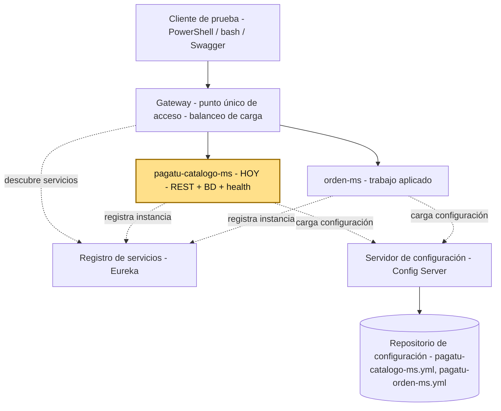

Hoy se construye el primer componente real de la U1: `pagatu-catalogo-ms`. En las siguientes sesiones se agregan configuración centralizada, registro de servicios, múltiples instancias, Gateway y balanceo. La evaluación U1 valida el sistema base integrado construido con esos componentes.

## 2. Explica

Tiempo: 25 min.

### 2.1 Arquitectura de la sesión

**Figura 2. Arquitectura de capas de `pagatu-catalogo-ms` en la sesión S1**

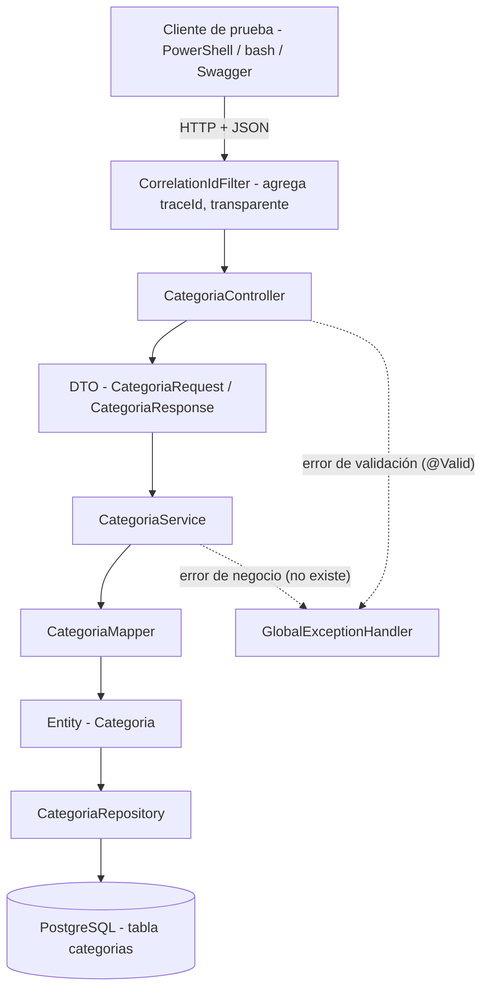

Lectura del diagrama:

- El cliente sí llama al controller — la petición pasa primero por el filtro de trazabilidad (agrega el `traceId`, no cambia el request) antes de llegar al controller. El cliente nunca nota esa capa intermedia.
- **En S1 el `traceId` lo genera el propio filtro**, porque todavía no hay frontend: el cliente de prueba es PowerShell/bash/Swagger, no Angular. Desde S11 (integración con el cliente frontend), Angular podrá enviar su propio `X-Trace-ID` y el filtro lo respeta en vez de generar uno nuevo — pero eso es fuera del alcance de U1.
- El controller recibe y devuelve **DTO** (`CategoriaRequest`/`CategoriaResponse`), nunca la entidad JPA directamente. El service delega en `CategoriaMapper` la conversión entre el DTO y la **entidad** `Categoria` antes de pasarla al repository (y de vuelta a DTO para la respuesta).
- El controller nunca habla directo con el repository ni con la base de datos: siempre pasa por el service.
- `GlobalExceptionHandler` recibe excepciones de **más de una capa**, no solo del controller: la validación `@Valid` falla en el borde del controller (antes de que su método se ejecute), pero `ResourceNotFoundException` la lanza la propia `CategoriaService`/`ProductoService` (en `buscarOFallar()`, ver 3.5.4 y 3.5.8) cuando el `id` no existe. Spring intercepta la excepción venga de donde venga y la enruta al handler — ninguna capa "llama" al handler explícitamente.
- Si algo falla en cualquier capa, `GlobalExceptionHandler` intercepta el error y responde con un formato consistente, en vez de dejar que el error crudo de Spring llegue al cliente.

Este diagrama es el mapa que guía el resto de la explicación: cada apartado siguiente desarrolla uno de sus componentes, en el mismo orden del Índice (1.2).

### 2.2 Arquitectura de un microservicio: responsabilidad única y capas internas

Un microservicio debe tener responsabilidad clara, persistencia propia, configuración por ambiente y capacidad de ejecutarse de forma independiente.

Ejemplo: `pagatu-catalogo-ms` se encarga de gestionar categorías, conceptos de pago y sus precios, con su propia base de datos. No debería guardar clientes, órdenes ni pagos. Si más adelante `orden-ms` necesita saber si un concepto de pago existe y cuál es su precio, consulta a `pagatu-catalogo-ms` por red en lugar de leer directamente su base de datos.

### 2.3 Persistencia: PostgreSQL y migraciones con Flyway

El microservicio no crea sus propias tablas al arrancar: **Flyway** ejecuta el script de migración (`V1__create_catalogo_tables.sql`, ver 3.5.1) una sola vez, y deja un registro de que ya se aplicó. Luego Hibernate/JPA solo **valida** que las entidades `Categoria` y `Producto` coincidan con las tablas creadas (`ddl-auto: validate`) — no crea ni modifica estructura.

**Figura 3. Modelo entidad-relación de `categorias` y `productos`**

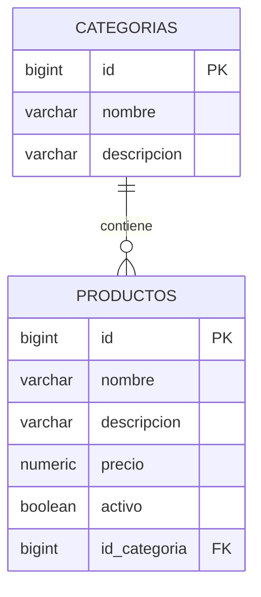

`id_categoria` es una llave foránea normal de PostgreSQL (`REFERENCES categorias(id)`), no una integración entre microservicios: ambas tablas viven en la misma base de datos de `pagatu-catalogo-ms`. Una `Categoria` puede existir sin `Producto`s asociados, pero todo `Producto` exige una `Categoria` válida (`NOT NULL`).

Esta separación importa: si Hibernate pudiera crear o alterar tablas solo (`ddl-auto: update`), el esquema real de producción quedaría a merced de cómo esté escrita la entidad Java en cada momento, sin historial ni control de versiones del cambio. Con Flyway, cada cambio de esquema es un script versionado y revisable, igual en DEV que en cualquier otro ambiente.

**Error frecuente**: si PostgreSQL está apagado o el contenedor de `compose-dev.yml` (ver 3.2.3) no levantó, la aplicación no arranca — Flyway no logra conectarse para aplicar la migración. Antes de asumir un error de código, revisa que el contenedor esté corriendo y que las variables de conexión coincidan.

### 2.4 Ejecución reproducible en DEV y escalamiento horizontal

#### 2.4.1 DEV: aplicación fuera de Docker

**Figura 4. Ejecución del microservicio en DEV, fuera de Docker**

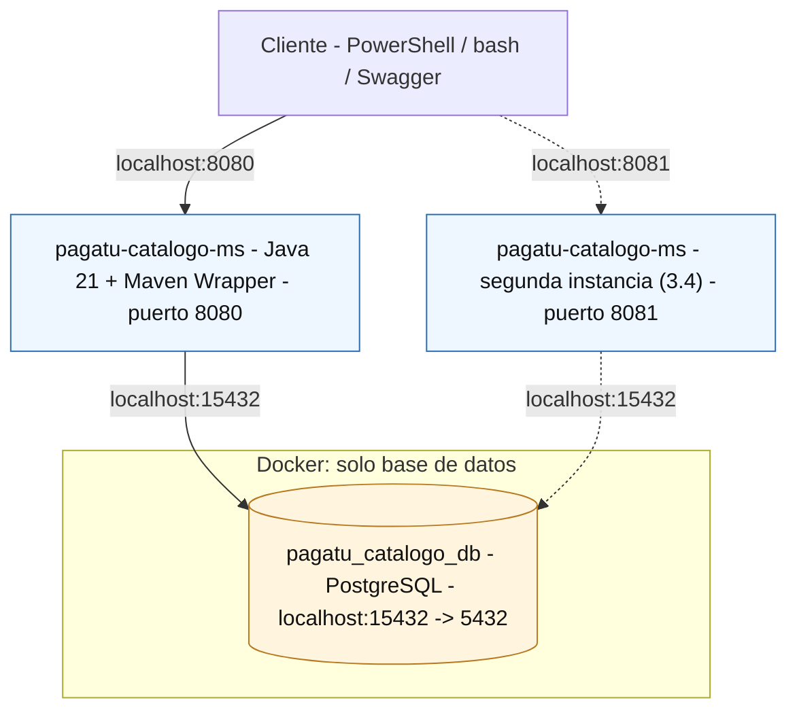

En DEV, la aplicación corre en el host con Maven Wrapper, en el puerto fijo `8080`; solo PostgreSQL corre en Docker. La segunda instancia (línea punteada, puerto `8081`) es el caso secundario que se practica más adelante, en 3.4 — el resto de esta guía trabaja solo con la primera instancia, en `8080`.

#### 2.4.2 PROD local: aplicación dentro de Docker

Esta parte sí se practica en S1 (ver 3.6-3.7) — muestra, por contraste con 2.4.1, qué cambia cuando la aplicación misma corre dentro de Docker, no solo la base de datos.

**Figura 5. Ejecución del microservicio en PROD local, dentro de Docker**

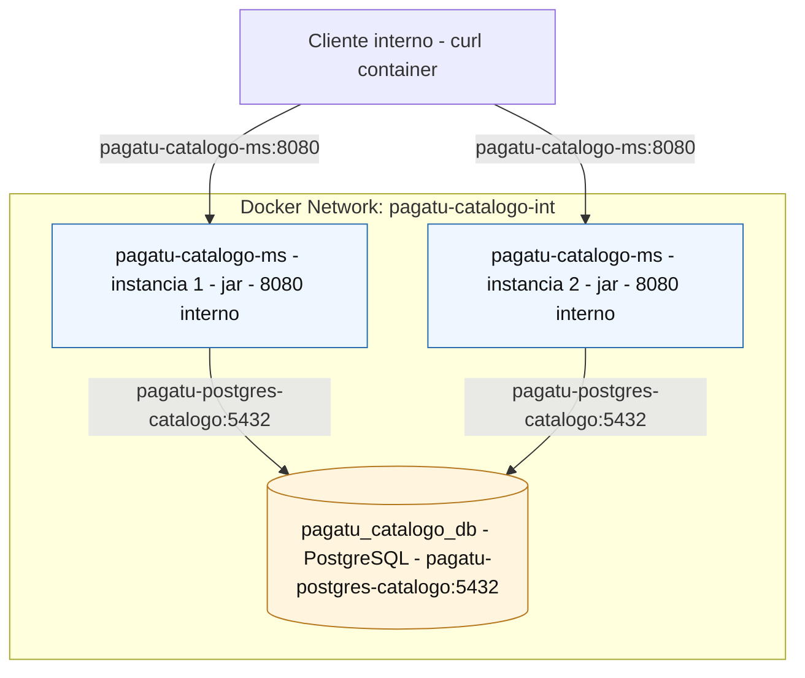

Las dos flechas del cliente muestran el **mismo** destino, `pagatu-catalogo-ms:8080` — eso es intencional, no un error: dentro de la red Docker, ambas instancias comparten ese mismo nombre de servicio y puerto interno, y es el DNS embebido de Docker el que reparte cada petición entre una u otra instancia por turno. Lo que cambia entre una petición y otra es **qué instancia responde por detrás**, no lo que el cliente pide — a diferencia de DEV (2.4.1), donde el cliente sí elige explícitamente `8080` u `8081`.

Regla práctica:

- Si la aplicación corre fuera de Docker, usa `localhost` con el puerto expuesto por Docker.
- Si la aplicación corre dentro de Docker, usa el nombre del servicio y el puerto interno.

**Error frecuente**: levantar más de dos instancias en el laboratorio. Cada instancia adicional consume CPU y memoria del equipo del estudiante sin aportar valor pedagógico extra en S1 — dos instancias bastan para demostrar el patrón (ver 3.4 y 3.7.4).

### 2.5 Contrato y versionado de API

**Versionado básico de API**: `pagatu-catalogo-ms` versiona su contrato en la propia URL (`/api/v1/...`). Es la forma más simple de versionado: si en el futuro un cambio rompe compatibilidad, se publica `/api/v2/...` sin obligar a los consumidores existentes (otros microservicios, un futuro frontend, o cualquier integración externa) a migrar de inmediato. En S1 basta con fijar el prefijo `v1`; no se implementa todavía coexistencia de versiones.

**Error frecuente**: dejar el contrato sin códigos de error documentados. Un contrato verificable incluye 400, 404 y 500, no solo el camino feliz.

Swagger (SpringDoc OpenAPI, ver 3.2.1) publica este contrato como documentación viva y siempre sincronizada con el código.

## 3. Aplica: actividad práctica guiada

Tiempo: 2h.

**Actividad:** construcción guiada de `pagatu-catalogo-ms`, el primer microservicio REST del proyecto, con CRUD completo de `Categoria` y `Producto` (Producto de la sesión en 1.4).

**Propósito de la actividad:** construir `pagatu-catalogo-ms` de punta a punta — desde el proyecto vacío hasta el CRUD completo de `Categoria` y `Producto` ejecutando en DEV, con persistencia, validación y trazabilidad — verificando cada incremento antes de continuar al siguiente.

**Orientaciones metodológicas:** en el laboratorio, el docente guía la construcción de `pagatu-catalogo-ms` paso a paso frente a la clase, y los estudiantes replican cada paso en su propio equipo, verificando el resultado con comandos de consola antes de avanzar al siguiente. La versión actual usa monorepo, nombres con sufijo `-ms` y PostgreSQL para los microservicios; el patrón completo se replica luego en `orden-ms` como trabajo aplicado (sección 4).

**Actividades para realizar:**

- **3.1** Instalar y verificar Java 21, VS Code y sus extensiones.
- **3.2** Crear el proyecto Spring Boot con las dependencias base y conexión a la base de datos.
- **3.3** Crear las excepciones y el filtro de trazabilidad.
- **3.4** Simular escalamiento horizontal (múltiples instancias).
- **3.5** Construir el CRUD de `Categoria` y `Producto`.
- **3.6** Configurar producción local con Docker (opcional).
- **3.7** Probar producción local con Docker (opcional).

### 3.1 Instalar y verificar Java 21 LTS, VS Code y sus extensiones

**Producto del paso:** entorno de desarrollo configurado con Java 21 y VS Code. Se asume Docker Desktop ya instalado (parte del stack tecnológico del curso, ver 1.1); PostgreSQL no se instala en el host, se levanta con Docker desde el paso 3.2.

En las clases se trabajará con **VS Code** para mantener una guía común. Puedes usar otro IDE si ya lo dominas — por ejemplo **IntelliJ IDEA** —, pero entonces sigue tú mismo la equivalencia de cada paso, ya que las capturas y comandos de esta guía están pensados para VS Code. Aún usando otro IDE, la ejecución recomendada del microservicio será desde la consola de comandos, al estilo de un servidor Linux.

**Windows** — **PowerShell** como usuario normal:

```powershell
winget install --id EclipseAdoptium.Temurin.21.JDK --exact
```

**macOS** (Homebrew no viene preinstalado en ningún Mac; una vez instalado,
el comando de Temurin es el mismo para Intel y para Apple Silicon
M1/M2/M3/M4 — Homebrew detecta la arquitectura automáticamente):

```bash
# 1. Instalar Homebrew (si no lo tiene)
/bin/bash -c "$(curl -fsSL https://raw.githubusercontent.com/Homebrew/install/HEAD/install.sh)"

# 2. Solo en Apple Silicon (M1/M2/M3/M4): agregar Homebrew al PATH.
#    Se instala en /opt/homebrew (no en /usr/local como en Intel), y el
#    propio instalador lo pide como paso obligatorio, no opcional.
echo 'eval "$(/opt/homebrew/bin/brew shellenv)"' >> ~/.zprofile
eval "$(/opt/homebrew/bin/brew shellenv)"

# 3. Instalar Temurin 21
brew install --cask temurin@21
```

**Linux (Ubuntu/Debian)** — repositorio oficial de Adoptium vía `apt`:

```bash
sudo apt install -y wget apt-transport-https gpg
wget -qO - https://packages.adoptium.net/artifactory/api/gpg/key/public | gpg --dearmor | sudo tee /etc/apt/trusted.gpg.d/adoptium.gpg > /dev/null
echo "deb https://packages.adoptium.net/artifactory/deb $(awk -F= '/^VERSION_CODENAME/{print$2}' /etc/os-release) main" | sudo tee /etc/apt/sources.list.d/adoptium.list
sudo apt update
sudo apt install -y temurin-21-jdk
```

**Linux (Fedora/RHEL)** — repositorio oficial de Adoptium vía `dnf`:

```bash
sudo tee /etc/yum.repos.d/adoptium.repo > /dev/null <<'EOF'
[Adoptium]
name=Adoptium
baseurl=https://packages.adoptium.net/artifactory/rpm/$(. /etc/os-release; echo $ID)/$releasever/$basearch
enabled=1
gpgcheck=1
gpgkey=https://packages.adoptium.net/artifactory/api/gpg/key/public
EOF
sudo dnf install -y temurin-21-jdk
```

Al finalizar, cierre y vuelva a abrir la terminal. Verifique la instalación:

```powershell
java --version
javac --version
```

**NOTA:** Ambas comprobaciones deben mostrar Java 21. Si conserva una versión anterior, configure `JAVA_HOME` con la ruta del JDK 21 desde las variables de entorno de Windows, actualice `Path` para que `%JAVA_HOME%\bin` tenga prioridad y abra una terminal nueva.

#### 3.1.1 Instalar VS Code y extensiones

**Producto del paso:** VS Code instalado con las extensiones necesarias para el resto de la sesión.

El curso usa **VS Code** como editor por defecto.

**Windows** `PS`:

```powershell
winget install -e --id Microsoft.VisualStudioCode
```

**macOS** :

```bash
brew install --cask visual-studio-code
```

**Linux (Ubuntu/Debian)** :

```bash
sudo snap install --classic code
```

En cualquier sistema también puede descargarse el instalador desde <https://code.visualstudio.com/download>.

Al finalizar, instala las extensiones desde la terminal:

```bash
code --install-extension vscjava.vscode-java-pack
code --install-extension vmware.vscode-boot-dev-pack
```
```bash
code --install-extension cweijan.vscode-database-client2
```

**Tabla 2. Extensiones de VS Code requeridas**

| Extensión | ID | Para qué sirve |
|---|---|---|
| Extension Pack for Java | `vscjava.vscode-java-pack` | Soporte base de Java (autocompletado, debug, Maven); incluye Spring Initializr Java Support, usado en 3.2.1. |
| Spring Boot Extension Pack | `vmware.vscode-boot-dev-pack` | Herramientas específicas de Spring Boot: navegación de beans, Spring Boot Dashboard, soporte de `application.yml`. |
| Database Client | `cweijan.vscode-database-client2` | Cliente gráfico multi-motor: MySQL, PostgreSQL, SQLite, SQL Server, Oracle, entre otros — sirve para conectarse a la PostgreSQL de este proyecto (ver 3.2.3). |

!!! tip "Si instalaste todo pero `Ctrl+Shift+P` → \"Spring\" no muestra ningún comando"
    El Spring Boot Extension Pack puede quedar **instalado pero deshabilitado**. Reiniciar VS Code (o toda la PC) no lo arregla si quedó en ese estado.

    Verifica en el panel de extensiones (`Ctrl+Shift+X`, buscar "Spring"): si el botón dice **Enable** en vez de **Disable**, está deshabilitado — actívalo. Recién ahí aparecen los comandos de Spring en la paleta de comandos.

### 3.2 Crear el proyecto Spring Boot desde VS Code con dependencias base y conexión a la base de datos

**Producto del paso:** proyecto Spring Boot creado en `services/pagatu-catalogo-ms`, con `artifactId` `pagatu-catalogo-ms`, paquete `pe.edu.upeu.catalogo`, dependencias base instaladas, PostgreSQL DEV levantado en Docker y un endpoint web simple respondiendo desde el navegador o shell.

En este paso no basta con crear el proyecto. Como se agregan `Spring Data JPA`, `PostgreSQL Driver` y `Flyway`, Spring Boot intentará configurar una conexión a base de datos al arrancar. Por eso, si ejecutas el microservicio sin configurar y levantar PostgreSQL, el arranque fallará.

Antes de crear el proyecto, así queda organizado el monorepo `pagatu` a partir de hoy:

```text
pagatu/
├── services/
│   └── pagatu-catalogo-ms/         <- hoy
├── infra/                    <- desde S2: config (S2), Eureka (S3), gateway (S4)
└── platform/                 <- desde S3: observabilidad (S3-S4), Kafka (S8)
```

- `services/` agrupa los microservicios de negocio — hoy solo `pagatu-catalogo-ms`, en sesiones futuras se suman más (`orden-ms`, `auth-ms`, `pago-ms`). Los separamos de la raíz para no mezclar carpetas de negocio con infraestructura de soporte.
- `infra/` es la infraestructura propia del sistema (Config Server, Eureka, Gateway): sostiene a los microservicios pero no tiene valor de negocio propio — se agrega progresivamente (Config Server en S2, Eureka en S3, Gateway en S4).
- `platform/` son dependencias compartidas de laboratorio, no exclusivas de `pagatu`: observabilidad (Prometheus/Loki desde S3, Grafana desde S4) y Kafka (mensajería asíncrona, desde S8).

#### 3.2.1 Crear el proyecto con Spring Initializr desde VS Code

Desde la raíz del monorepo `pagatu`, abre VS Code, `Ctrl+Shift+P` y ejecuta el comando:

```text
Spring Initializr: Create a Maven Project
```

Usa la siguiente configuración:

**Tabla 3. Configuración del proyecto en Spring Initializr**

| Campo | Valor |
|---|---|
| Project | Maven Project |
| Spring Boot | **4.0.7** |
| Language | Java |
| Group Id | `pe.edu.upeu` |
| Artifact Id | `pagatu-catalogo-ms` |
| Package name | `pe.edu.upeu.catalogo` |
| Packaging | Jar |
| Java | 21 |
| Dependencias | Seleccionar dependencias del proyecto |
| Ubicación sugerente | `services/pagatu-catalogo-ms` puedes poner en cualquier lugar |

Nota sobre la versión: el generador de Spring Initializr ya no ofrece ninguna versión 3.x — las únicas opciones son líneas 4.x. Se fija **4.0.7** por el mismo motivo verificado en LP2 (ver `docs/lp2/adr/ADR-003-spring-boot-4.md` del repo `bomerp`): dentro de la línea 4.x, SpringDoc OpenAPI declara compatibilidad solo hasta `4.1.0-M1`, así que 4.0.7 es la versión estable dentro de ese rango. Si al generar el proyecto ves `spring-boot-starter-web` reemplazado por `spring-boot-starter-webmvc`, o starters de prueba granulares en vez de uno solo, es esperado en esta línea de Boot — no lo corrijas.

Dependencias a seleccionar:

**Tabla 4. Dependencias del proyecto**

| Grupo | Dependencias | Propósito |
|---|---|---|
| API REST base | Spring Web, Validation | Exponer endpoints HTTP y validar entradas |
| Productividad | Lombok, Spring Boot DevTools | Reducir código repetitivo y facilitar ejecución en desarrollo |
| Documentación y operación | SpringDoc OpenAPI WebMvc UI, Spring Boot Actuator | Documentar la API con Swagger y verificar health |
| Persistencia | Spring Data JPA, PostgreSQL Driver, Flyway | Acceso a datos, conexión a PostgreSQL y migraciones de BD |

Referencia visual (selección real en VS Code con Spring Boot 4.0.7, las 9 dependencias de la tabla):

**Figura 6. Selección de dependencias en Spring Initializr (1/2)**

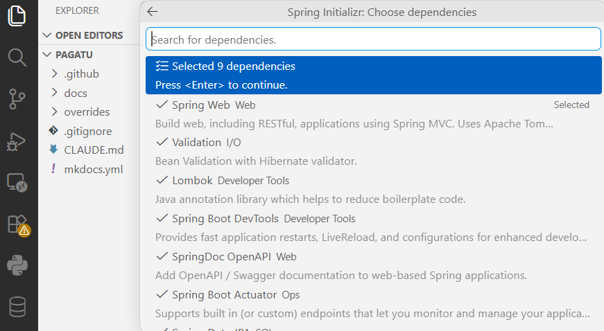

**Figura 7. Selección de dependencias en Spring Initializr (2/2)**

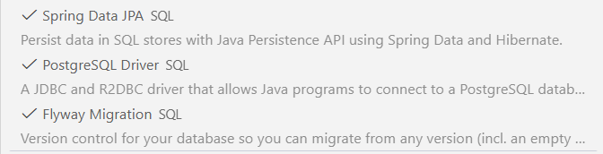

Nota sobre motor de base de datos: en DIST se trabaja con **PostgreSQL** (no Oracle — Oracle es el motor de LP2/BD2, fuera del alcance de este curso). Si el equipo prefiere **MySQL**, es una alternativa válida: cambia `PostgreSQL Driver` por `MySQL Driver` en el Initializr y `flyway-database-postgresql` por `flyway-mysql` en el `pom.xml` — el resto de la guía (Flyway, JPA, `ddl-auto: validate`) aplica igual, solo cambia el driver y la URL de conexión.

Después de `Enter`, el asistente pide dónde guardar el proyecto. Navega hasta `services/` y da clic en **"Generate into this folder"**:

**Figura 8. Selector de carpeta de VS Code para generar el proyecto**

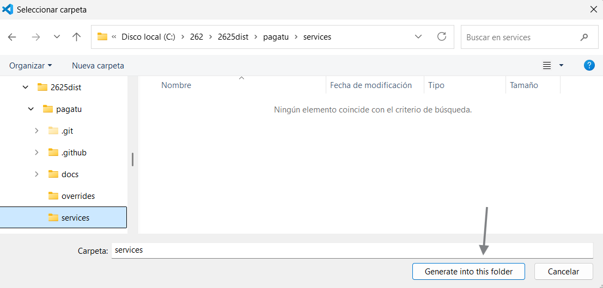

Al terminar, VS Code confirma la generación y el proyecto queda visible en el Explorer:

**Figura 9. Proyecto generado, visible en el Explorer de VS Code**

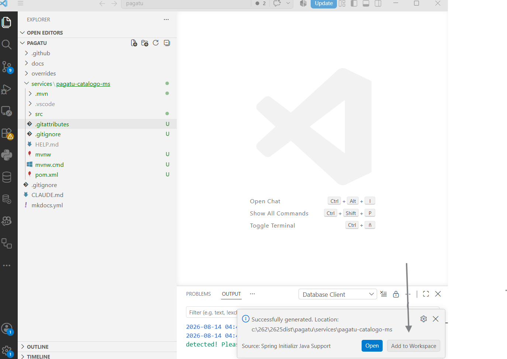
 
#### 3.2.2 Ejecutar una primera vez y reconocer el fallo esperado

El proyecto trae Maven Wrapper (`mvnw`/`mvnw.cmd`): no requiere tener Maven instalado en el host, así que todos los comandos Maven de esta guía se ejecutan con el wrapper, nunca con `mvn` a secas.

Ubícate en la carpeta del microservicio:

```powershell
# Windows (PowerShell o cmd)
cd services/pagatu-catalogo-ms
.\mvnw.cmd spring-boot:run
```

```bash
# macOS / Linux
cd services/pagatu-catalogo-ms
./mvnw spring-boot:run
```

Si todavía no existe configuración de base de datos, el error esperado será parecido a:

```text
APPLICATION FAILED TO START
Failed to configure a DataSource: 'url' attribute is not specified and no embedded datasource could be configured.
Reason: Failed to determine a suitable driver class
```

No se corrige quitando JPA ni usando H2. Se corrige declarando PostgreSQL DEV y levantando la base de datos con Docker.

#### 3.2.3 Configurar el ambiente de desarrollo

**Producto del paso:** ambiente DEV completo — PostgreSQL en Docker y la aplicación configurada para conectarse a él.

El ambiente de desarrollo de `pagatu-catalogo-ms` tiene dos partes: PostgreSQL corriendo en Docker (`compose-dev.yml`) y la propia aplicación configurada para encontrarlo (`application.yml`/`application-dev.yml`). La aplicación se ejecuta en DEV con Maven Wrapper desde el host — solo la base de datos vive en Docker.

**Docker: PostgreSQL DEV**

En `services/pagatu-catalogo-ms`, crea el archivo `compose-dev.yml`:

```yaml
name: pagatu-catalogo-dev

services:
  postgres-catalogo-dev:
    image: postgres:16-alpine
    container_name: pagatu-postgres-catalogo-dev
    restart: unless-stopped
    environment:
      POSTGRES_DB: pagatu_catalogo_db
      POSTGRES_USER: pagatu
      POSTGRES_PASSWORD: pagatu
    ports:
      - "15432:5432"
    volumes:
      - pagatu_catalogo_dev_data:/var/lib/postgresql/data

volumes:
  pagatu_catalogo_dev_data:
```

**`compose-dev.yml` equivalente con MySQL** (alternativa a esta misma, con un usuario propio en vez de `root`):

```yaml
name: pagatu-catalogo-dev

services:
  mysql-catalogo-dev:
    image: mysql:8.4
    container_name: pagatu-mysql-catalogo-dev
    restart: unless-stopped
    environment:
      MYSQL_ROOT_PASSWORD: pagatu
      MYSQL_DATABASE: pagatu_catalogo_db
      MYSQL_USER: pagatu
      MYSQL_PASSWORD: pagatu
    ports:
      - "13306:3306"
    volumes:
      - pagatu_catalogo_dev_data:/var/lib/mysql

volumes:
  pagatu_catalogo_dev_data:
```

`MYSQL_USER`/`MYSQL_PASSWORD` crean el usuario `pagatu` con privilegios acotados a `pagatu_catalogo_db` — la aplicación se conecta como `pagatu`, no como `root`. `MYSQL_ROOT_PASSWORD` sigue siendo obligatorio para la imagen (MySQL no arranca sin él), pero no lo usa el backend. La URL de conexión en `application-dev.yml` cambiaría a `jdbc:mysql://localhost:13306/pagatu_catalogo_db`.

Levanta la base de datos:

PowerShell / bash macOS/Linux:

```bash
docker compose -f compose-dev.yml up -d
docker ps
```

Además de `docker ps`, puedes verificar la conexión con un cliente gráfico de base de datos (extensión de VS Code, DBeaver, pgAdmin, etc.): host `127.0.0.1`, puerto `15432`, usuario y contraseña `pagatu`, base de datos `pagatu_catalogo_db`. En este punto (solo el contenedor levantado, sin ejecutar aún la aplicación) la conexión ya debe ser exitosa, con la base vacía — la captura de referencia se tomó luego de ejecutar la aplicación, después de que Flyway aplicó la migración, por eso ya muestra la tabla `flyway_schema_history`.

**Figura 10. Conexión exitosa a PostgreSQL vía cliente gráfico en VS Code**

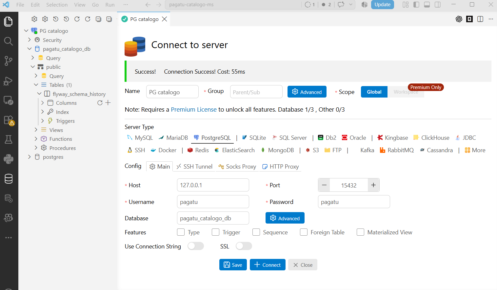

**Aplicación: `application.yml` y `application-dev.yml`**

Como la aplicación corre fuera de Docker y solo PostgreSQL corre dentro, la configuración debe apuntar a `localhost:15432`, que es el puerto publicado por el contenedor de base de datos.

En `src/main/resources`, crea o ajusta `application.yml` como configuración base:

```yaml
spring:
  application:
    name: pagatu-catalogo-ms
  profiles:
    active: dev
```

Luego crea `application-dev.yml` para la configuración de desarrollo:

```yaml
server:
  port: 8080

spring:
  datasource:
    url: jdbc:postgresql://localhost:15432/pagatu_catalogo_db
    username: pagatu
    password: pagatu
    driver-class-name: org.postgresql.Driver
  flyway:
    enabled: true
    locations: classpath:db/migration
  jpa:
    hibernate:
      ddl-auto: validate
    show-sql: true
    properties:
      hibernate:
        format_sql: true
  devtools:
    restart:
      enabled: true
    livereload:
      enabled: true

springdoc:
  swagger-ui:
    path: /swagger-ui.html

logging:
  level:
    pe.edu.upeu.catalogo: DEBUG

management:
  endpoints:
    web:
      exposure:
        include: health,info,metrics
  endpoint:
    health:
      show-details: always
```

El puerto queda fijo en `8080` para todo el resto de esta guía — más simple para probar con Swagger/shell sin tener que buscar qué puerto asignó Spring Boot cada vez. Cuando en 3.4 se necesite escalar a varias instancias, el puerto de la segunda se pasa como argumento de línea de comandos, sin tocar este archivo (ver 3.4).

En DEV, Flyway queda activo y ejecuta automáticamente `V1__create_catalogo_tables.sql` al arrancar la aplicación (se crea en 3.5.1). JPA/Hibernate no crea tablas; solo valida que las entidades coincidan con la estructura de la base de datos mediante `ddl-auto: validate`.

En S2 esta configuración se moverá progresivamente al Config Server, que busca el archivo de configuración por `spring.application.name` (`pagatu-catalogo-ms.yml` en el config-repo) — por eso ese nombre lleva el mismo prefijo `pagatu-` que el `artifactId`, y no queda como `pagatu-catalogo-ms` a secas: evita ambigüedad si en algún momento hay otro proyecto con un servicio del mismo nombre corriendo contra un registro compartido. En S1 la configuración se mantiene local para que el alumno entienda primero qué necesita el microservicio para arrancar.

#### 3.2.4 Ejecutar y comprobar que ya no falla

Antes de ejecutar la aplicación, comprueba desde la consola que PostgreSQL DEV está listo y que la base de datos existe.

PowerShell / bash macOS/Linux:

```bash
docker exec -it pagatu-postgres-catalogo-dev psql -U pagatu -d pagatu_catalogo_db -c "SELECT current_database();"
docker exec -it pagatu-postgres-catalogo-dev psql -U pagatu -d pagatu_catalogo_db -c "\dt"
```

Resultado esperado:

```text
current_database
------------------
pagatu_catalogo_db
```

Si `\dt` muestra `Did not find any relations`, está bien en este momento: aún no se ha creado la tabla `categorias`.

Con PostgreSQL DEV levantado y verificado, ejecuta la aplicación:

```powershell
# Windows (PowerShell o cmd)
.\mvnw.cmd spring-boot:run
```

```bash
# macOS / Linux
./mvnw spring-boot:run
```

Verifica que la aplicación arrancó sin el error de conexión de 3.2.2:

```text
Tomcat started on port 8080 (http) with context path '/'
```

Confirma también con `/actuator/health` (disponible desde 3.2.1, sin necesitar ningún endpoint propio todavía):

PowerShell:

```powershell
Invoke-RestMethod `
  -Method Get `
  -Uri "http://localhost:8080/actuator/health"
```

bash macOS/Linux:

```bash
curl http://localhost:8080/actuator/health
```

Resultado esperado: `{"status":"UP"}`. Deja la aplicación corriendo — el siguiente paso la modifica en caliente, sin reiniciarla a mano.

#### 3.2.5 Crear un endpoint temporal de saludo

Con la aplicación todavía corriendo (3.2.4), crea un controlador mínimo — esto también sirve para comprobar que Spring Boot DevTools recarga en caliente (*hot reload*) sin que vuelvas a ejecutar `spring-boot:run`.

**`controller/SaludoController.java`**

```java
package pe.edu.upeu.catalogo.controller;

import org.springframework.web.bind.annotation.GetMapping;
import org.springframework.web.bind.annotation.RestController;

@RestController
public class SaludoController {

    @GetMapping("/saludo")
    public String saludo() {
        return "pagatu-catalogo-ms activo";
    }
}
```

Al guardar el archivo, la misma terminal donde sigue corriendo `spring-boot:run` (3.2.4) debe mostrar que DevTools detectó el cambio y reinició sola, sin que la detengas ni la vuelvas a lanzar:

```text
Restarting due to 1 class path change (1 addition, 0 deletions, 0 modifications)
```

Prueba el endpoint:

PowerShell:

```powershell
Invoke-RestMethod `
  -Method Get `
  -Uri "http://localhost:8080/saludo"
```

bash macOS/Linux:

```bash
curl http://localhost:8080/saludo
```

También puedes revisar Swagger en el puerto `8080`:

```text
http://localhost:8080/swagger-ui/index.html
```

Este endpoint es temporal para validar el arranque web y el hot-reload de DevTools. Luego el foco pasará al CRUD de categorías y productos.

**Evidencia de cierre del paso 3.2**

- Proyecto creado en `services/pagatu-catalogo-ms`.
- `pom.xml` con dependencias base y persistencia PostgreSQL.
- PostgreSQL DEV ejecutando en Docker.
- `application.yml` con perfil `dev` activo.
- `application-dev.yml` con puerto `8080` y conexión a PostgreSQL DEV.
- Endpoint `/saludo` respondiendo.

### 3.3 Crear las excepciones y el filtro de trazabilidad

**Producto del paso:** manejo de errores centralizado y filtro de trazabilidad (`traceId` en cada log) funcionando en `pagatu-catalogo-ms`, antes de construir el CRUD.

Antes de construir `Categoria` y `Producto` (3.5), se crean dos piezas **compartidas** que usa todo el microservicio, no una entidad en particular: el manejo de errores y el filtro de trazabilidad. Así, cuando llegue el turno de cada recurso, `ResourceNotFoundException` ya existe y puede usarse directamente.

#### 3.3.1 Crear las excepciones y el manejador global de errores

Estas clases son **compartidas**: no son específicas de `Categoria` ni de `Producto`, cualquier módulo de `pagatu-catalogo-ms` las reutiliza tal cual.

**`exception/ResourceNotFoundException.java`**

```java
package pe.edu.upeu.catalogo.exception;

public class ResourceNotFoundException extends RuntimeException {
    public ResourceNotFoundException(String mensaje) {
        super(mensaje);
    }
}
```

**`exception/GlobalExceptionHandler.java`**

```java
package pe.edu.upeu.catalogo.exception;

import org.springframework.http.HttpStatus;
import org.springframework.http.ResponseEntity;
import org.springframework.web.bind.MethodArgumentNotValidException;
import org.springframework.web.bind.annotation.ExceptionHandler;
import org.springframework.web.bind.annotation.RestControllerAdvice;

import java.time.Instant;
import java.util.HashMap;
import java.util.Map;

@RestControllerAdvice
public class GlobalExceptionHandler {

    @ExceptionHandler(ResourceNotFoundException.class)
    public ResponseEntity<Map<String, Object>> handleNotFound(ResourceNotFoundException ex) {
        Map<String, Object> body = new HashMap<>();
        body.put("timestamp", Instant.now().toString());
        body.put("status", HttpStatus.NOT_FOUND.value());
        body.put("error", "Not Found");
        body.put("message", ex.getMessage());
        return ResponseEntity.status(HttpStatus.NOT_FOUND).body(body);
    }

    @ExceptionHandler(MethodArgumentNotValidException.class)
    public ResponseEntity<Map<String, Object>> handleValidation(MethodArgumentNotValidException ex) {
        Map<String, Object> body = new HashMap<>();
        body.put("timestamp", Instant.now().toString());
        body.put("status", HttpStatus.BAD_REQUEST.value());
        body.put("error", "Bad Request");
        body.put("message", "Error de validación en los datos enviados");
        return ResponseEntity.status(HttpStatus.BAD_REQUEST).body(body);
    }
}
```

#### 3.3.2 Crear el filtro de trazabilidad `CorrelationIdFilter` y configurar logs

Este filtro agrega un identificador de trazabilidad a cada request usando el header `X-Trace-ID`. Si el cliente no lo envía, el filtro genera un UUID.

En S1 la trazabilidad es interna al microservicio:

```text
Cliente shell / Swagger -> Controller -> Service -> Repository -> BD
```

Todos los logs producidos durante esa petición pueden compartir el mismo `traceId`.

**`filter/CorrelationIdFilter.java`**

```java
package pe.edu.upeu.catalogo.filter;

import jakarta.servlet.FilterChain;
import jakarta.servlet.ServletException;
import jakarta.servlet.http.HttpServletRequest;
import jakarta.servlet.http.HttpServletResponse;
import org.slf4j.MDC;
import org.springframework.stereotype.Component;
import org.springframework.web.filter.OncePerRequestFilter;

import java.io.IOException;
import java.util.UUID;

@Component
public class CorrelationIdFilter extends OncePerRequestFilter {

    public static final String TRACE_ID_HEADER = "X-Trace-ID";
    public static final String MDC_KEY = "traceId";

    @Override
    protected void doFilterInternal(HttpServletRequest request,
                                     HttpServletResponse response,
                                     FilterChain filterChain) throws ServletException, IOException {
        String traceId = request.getHeader(TRACE_ID_HEADER);
        if (traceId == null || traceId.isBlank()) {
            traceId = UUID.randomUUID().toString();
        }
        try {
            MDC.put(MDC_KEY, traceId);
            response.setHeader(TRACE_ID_HEADER, traceId);
            filterChain.doFilter(request, response);
        } finally {
            MDC.remove(MDC_KEY);
        }
    }
}
```

Crea también `src/main/resources/logback-spring.xml`. Este archivo define el formato de logs e incluye el `traceId` en cada línea (`[%X{traceId}]`), con salida por consola y por archivo en `logs/catalogo.log`:

```xml
<?xml version="1.0" encoding="UTF-8"?>
<configuration>
    <include resource="org/springframework/boot/logging/logback/defaults.xml"/>

    <property name="LOG_PATTERN"
              value="%d{yyyy-MM-dd HH:mm:ss.SSS} [%X{traceId}] %-5level %logger{36} - %msg%n"/>

    <appender name="CONSOLE" class="ch.qos.logback.core.ConsoleAppender">
        <encoder>
            <pattern>${LOG_PATTERN}</pattern>
        </encoder>
    </appender>

    <appender name="FILE" class="ch.qos.logback.core.rolling.RollingFileAppender">
        <file>logs/catalogo.log</file>
        <encoder>
            <pattern>${LOG_PATTERN}</pattern>
        </encoder>
        <rollingPolicy class="ch.qos.logback.core.rolling.TimeBasedRollingPolicy">
            <fileNamePattern>logs/catalogo-%d{yyyy-MM-dd}.log</fileNamePattern>
            <maxHistory>7</maxHistory>
        </rollingPolicy>
    </appender>

    <root level="INFO">
        <appender-ref ref="CONSOLE"/>
        <appender-ref ref="FILE"/>
    </root>
</configuration>
```

Más adelante, cuando se agreguen Gateway, Feign o frontend, el mismo header `X-Trace-ID` podrá propagarse entre componentes para trazabilidad distribuida.

#### 3.3.3 Ejecutar y probar

**Verifica el cambio de formato.** Antes de `logback-spring.xml`, la terminal mostraba el formato por defecto de Spring Boot (timestamp con zona horaria, PID, nombre de la app y del hilo):

```text
2026-08-15T18:51:40.107-05:00  INFO 3804 --- [pagatu-catalogo-ms] [  restartedMain] p.e.u.c.PagatuCatalogoMsApplication      : Started PagatuCatalogoMsApplication in 1.765 seconds (process running for 110927.327)
```

Después de reiniciar con `logback-spring.xml` en su lugar, el formato cambia al patrón definido (`[%X{traceId}]` en vez de PID/app/hilo):

```text
2026-08-15 18:53:05.581 [] INFO  o.s.boot.tomcat.TomcatWebServer - Tomcat started on port 8080 (http) with context path '/'
2026-08-15 18:53:05.590 [] INFO  p.e.u.c.PagatuCatalogoMsApplication - Started PagatuCatalogoMsApplication in 1.715 seconds (process running for 111012.81)
2026-08-15 18:53:17.004 [22deb350-54b4-4dea-a9c6-b09aaae9cea6] INFO  o.s.api.AbstractOpenApiResource - Init duration for springdoc-openapi is: 113 ms
```

Las primeras líneas (arranque de la app) muestran `[]` vacío: todavía no hay ninguna petición HTTP en curso, así que el `MDC` no tiene `traceId` que mostrar. La última línea ya trae un `traceId` real (`22deb350-...`) porque llegó una petición HTTP (por ejemplo, al abrir Swagger UI): el `CorrelationIdFilter` generó el UUID, lo puso en el `MDC`, y ese log —disparado durante esa petición— lo heredó automáticamente. Es la prueba de que el filtro de trazabilidad ya funciona de punta a punta.

### 3.4 Simular escalamiento horizontal (múltiples instancias)

**Producto del paso:** dos instancias de `pagatu-catalogo-ms` corriendo al mismo tiempo, cada una en un puerto distinto, ambas conectadas a la misma PostgreSQL DEV.

**Figura 11. Escalamiento horizontal de `pagatu-catalogo-ms` con dos instancias en paralelo**

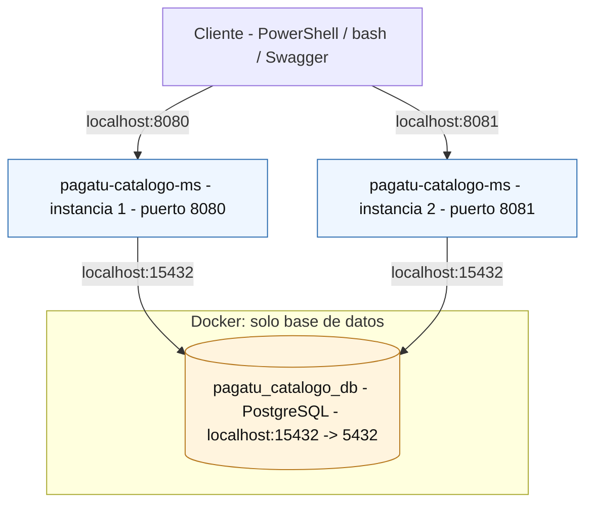

Un microservicio distribuido debe poder escalar horizontalmente: correr varias copias idénticas a la vez, cada una en su propio puerto, sin configuración fija que las haga chocar. Con `server.port` fijo en `8080` (el que usa el resto de esta guía), una segunda instancia no puede arrancar en la misma máquina — el puerto ya está ocupado.

#### 3.4.1 Levantar una segunda instancia

**Sin modificar `application-dev.yml`** (para no romper el puerto 8080 que usan los pasos siguientes de esta guía), la Terminal 1 sigue corriendo tal cual en `8080` (la que ya tenías abierta desde 3.3.3). Abre una **Terminal 2** nueva y pásale un puerto distinto como argumento de línea de comandos, desde `services/pagatu-catalogo-ms`:

```powershell
# Windows (PowerShell o cmd) - Terminal 2 (simultánea, con Postgres y la Terminal 1 ya corriendo en 8080)
.\mvnw.cmd spring-boot:run "-Dspring-boot.run.arguments=--server.port=8081"
```

```bash
# macOS / Linux - Terminal 2 (simultánea, con Postgres y la Terminal 1 ya corriendo en 8080)
./mvnw spring-boot:run -Dspring-boot.run.arguments=--server.port=8081
```

`--server.port=8081` le indica a Spring Boot que arranque en ese puerto en vez del `8080` fijo del `application-dev.yml`. También puedes usar `--server.port=0` si prefieres que el sistema operativo asigne uno libre cualquiera — la diferencia es que con `8081` sabes el puerto de antemano, sin tener que leerlo de la consola.

#### 3.4.2 Ejecutar y probar

Verifica que ambas instancias responden por separado, con el endpoint de saludo y con `/actuator/health`:

PowerShell:

```powershell
Invoke-RestMethod -Method Get -Uri "http://localhost:8080/saludo"
Invoke-RestMethod -Method Get -Uri "http://localhost:8081/saludo"
Invoke-RestMethod -Method Get -Uri "http://localhost:8080/actuator/health"
Invoke-RestMethod -Method Get -Uri "http://localhost:8081/actuator/health"
```

bash macOS/Linux:

```bash
curl http://localhost:8080/saludo
curl http://localhost:8081/saludo
curl http://localhost:8080/actuator/health
curl http://localhost:8081/actuator/health
```

Resultado esperado: ambas responden `pagatu-catalogo-ms activo` y `{"status":"UP"}`, cada una en su propio puerto, conectadas de forma independiente a la misma PostgreSQL DEV.

**Por qué importa esto en S1.** Todavía no hay Gateway ni balanceador de carga — eso llega en S4 ("Punto único de acceso y distribución de tráfico"). Pero la capacidad de correr múltiples instancias sin puerto fijo es la base técnica que un balanceador necesita para repartir tráfico entre copias del mismo servicio; practicarla desde S1 deja esa evidencia lista para cuando el Gateway integre esta pieza.

!!! note "3.6 y 3.7 son opcionales"
    El alcance evaluado de S1 termina en el escalamiento horizontal de 3.4. Producción local con Docker (3.6-3.7) es contenido adicional: profundiza la ejecución reproducible del microservicio, pero no es necesario completarlo para que la sesión se considere lograda, y no es prerequisito de S2 — Config Server (S2) se configura sobre el microservicio ejecutando en DEV, sin depender de que la aplicación misma haya corrido dentro de Docker. Si te queda tiempo en clase o quieres profundizar por tu cuenta, adelante.

### 3.5 Construir el CRUD de `Categoria` y `Producto`

**Producto del paso:** CRUD de `Categoria` y de `Producto` incorporados en `pagatu-catalogo-ms`, incluyendo entidades, capas de aplicación, validaciones y migración de base de datos, escritos directamente por el estudiante (sin depender de un repositorio externo), ejecutando en DEV con Swagger, health y CRUD verificados por shell.

`pagatu-catalogo-ms` gestiona lo que se puede comprar o pagar: no solo categorías, también los conceptos de pago concretos (`Producto`: nombre, descripción, precio y si está activo). Ambas entidades se construyen en esta misma sesión, siguiendo exactamente el mismo patrón de capas una y otra vez — una vez que entiendes el patrón con `Categoria`, replicarlo en `Producto` es mecánico.

Cada archivo de este paso se crea directamente dentro de `services/pagatu-catalogo-ms/src/main/java/pe/edu/upeu/catalogo` (o en `src/main/resources` cuando corresponda), siguiendo la misma estructura de carpetas usada en todo el curso:

```text
config
controller
dto
entity
exception
filter
mapper
repository
service
```

`exception/` y `filter/` ya se crearon en 3.3 — aquí se agregan `entity`, `repository`, `dto`, `mapper`, `service` y `controller`.

Con `ddl-auto: validate` (ver 2.3), JPA no crea ni modifica tablas: solo compara las entidades contra lo que ya existe en la base de datos, y si no coincide, la aplicación falla al arrancar. Por eso el orden lógico es primero la migración Flyway, que define la estructura real, y recién después las entidades Java, que deben coincidir con ella exactamente.

#### 3.5.1 Crear la migración Flyway de `categorias` y `productos`

**Producto del paso:** migración `V1` aplicada sobre una base DEV limpia, con las tres tablas creadas (`categorias`, `productos`, `flyway_schema_history`) y verificadas en `localhost:8080`.

Antes de crear el archivo, baja el contenedor de PostgreSQL DEV y borra su volumen, para garantizar que Flyway va a aplicar la migración sobre una base completamente vacía — así se escribe el archivo una sola vez y se ejecuta una sola vez, sin arriesgarte a editar una migración que Flyway ya aplicó (ver el aviso al final de este paso):

```bash
docker compose -f compose-dev.yml down -v
```

**`src/main/resources/db/migration/V1__create_catalogo_tables.sql`**

El archivo crea **ambas** tablas de una vez, por eso su nombre no describe solo `Categoria`:

```sql
CREATE TABLE IF NOT EXISTS categorias (
    id BIGINT GENERATED BY DEFAULT AS IDENTITY,
    nombre VARCHAR(100) NOT NULL,
    descripcion VARCHAR(255),
    PRIMARY KEY (id)
);

CREATE TABLE IF NOT EXISTS productos (
    id BIGINT GENERATED BY DEFAULT AS IDENTITY,
    nombre VARCHAR(100) NOT NULL,
    descripcion VARCHAR(255),
    precio NUMERIC(10,2) NOT NULL,
    activo BOOLEAN NOT NULL DEFAULT true,
    id_categoria BIGINT NOT NULL REFERENCES categorias(id),
    PRIMARY KEY (id)
);
```

`productos` sí lleva la relación con `categorias` desde esta primera versión: `id_categoria` es una llave foránea (`REFERENCES categorias(id)`) porque ambas tablas viven en la misma base de datos del mismo microservicio — es una relación relacional normal, no una llamada entre microservicios. Feign (o cualquier cliente HTTP) solo haría falta si `Categoria` y `Producto` vivieran en microservicios distintos; no es el caso aquí.

Con el archivo ya guardado (contenido final, sin más ediciones pendientes), levanta de nuevo el contenedor sobre la base vacía:

```bash
docker compose -f compose-dev.yml up -d
```

```powershell
# Windows (PowerShell o cmd)
.\mvnw.cmd spring-boot:run
```

```bash
# macOS / Linux
./mvnw spring-boot:run
```

Ejecuta la aplicación (3.2.4). Flyway aplica `V1` automáticamente al arrancar y crea las tres tablas: `categorias`, `productos` y `flyway_schema_history`.

**Figura 12. Resultado al ejecutar la aplicación: las tres tablas creadas**

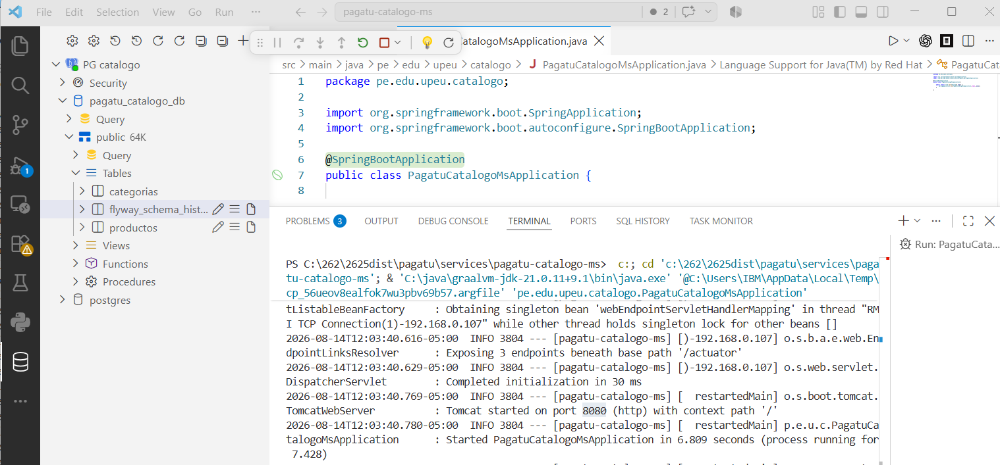

Verifica en el navegador o con `curl`/`Invoke-RestMethod` que `localhost:8080` responde: el endpoint `/saludo` (3.2.5) y `/actuator/health` (`{"status":"UP"}`, confirma que la conexión a PostgreSQL sigue viva después de aplicar la migración).

Lo que queda definido desde ahora es la estructura exacta que las entidades `Categoria` y `Producto` (siguiente paso) tienen que respetar: mismos nombres de columna, mismo `NOT NULL`, mismo tipo, y la misma llave foránea. Si alguna entidad no coincide, `ddl-auto: validate` hará fallar el arranque con un error claro señalando la diferencia.

**Aviso — `Migration checksum mismatch`:** Flyway trata cada migración ya aplicada como inmutable. Si de aquí en adelante necesitas corregir algo en `V1__create_catalogo_tables.sql` después de haberlo ejecutado, **no lo edites** — Spring Boot DevTools reinicia la app en cada guardado, Flyway recalcula el checksum del archivo, y como ya no coincide con el que quedó guardado en `flyway_schema_history`, el arranque falla con `Migration checksum mismatch for migration version 1`. Dos salidas: repetir el reset de este paso (`down -v` / `up -d`, válido mientras no haya datos reales que perder) o crear un archivo nuevo `V2__create_catalogo_tables.sql` con la corrección (obligatorio si ya hay datos que no quieres perder) — Flyway solo aplica migraciones nuevas hacia adelante, nunca reescribe una ya aplicada.

**Si ya tienes datos que no quieres perder** (más adelante en el curso, con datos de prueba cargados): no edites `V1`. Crea un archivo nuevo `V2__create_catalogo_tables.sql` con la corrección — Flyway solo aplica migraciones nuevas hacia adelante, nunca reescribe una ya aplicada.

Con la migración lista, ahora se construye `Categoria` completo: entidad, repositorio, DTO, mapper, servicio y controlador, en ese orden — antes de tocar `Producto`.

!!! note "Entrega en dos partes: tags `s01-servicio-base-p1` / `s01-servicio-base-p2`"
    Hasta aquí (Figura 12, las tres tablas creadas por Flyway) llega la
    primera entrega de S1, tag `s01-servicio-base-p1`. La construcción del
    CRUD de `Categoria` y `Producto` (3.5.2 en adelante: entidad,
    repositorio, DTO, mapper, servicio y controlador de cada uno) es la
    segunda entrega, tag `s01-servicio-base-p2`.

#### 3.5.2 Crear la entidad `Categoria`

**`entity/Categoria.java`**

```java
package pe.edu.upeu.catalogo.entity;

import jakarta.persistence.*;
import lombok.*;

@Entity
@Table(name = "categorias")
@Getter
@Setter
@Builder
@NoArgsConstructor
@AllArgsConstructor
public class Categoria {

    @Id
    @GeneratedValue(strategy = GenerationType.IDENTITY)
    private Long id;

    @Column(name = "nombre", nullable = false, length = 100)
    private String nombre;

    @Column(name = "descripcion", length = 255)
    private String descripcion;
}
```

#### 3.5.3 Crear el repositorio, los DTO y el mapper de `Categoria`

**`repository/CategoriaRepository.java`**

```java
package pe.edu.upeu.catalogo.repository;

import pe.edu.upeu.catalogo.entity.Categoria;
import org.springframework.data.jpa.repository.JpaRepository;

public interface CategoriaRepository extends JpaRepository<Categoria, Long> {
}
```

**`dto/CategoriaRequest.java`**

```java
package pe.edu.upeu.catalogo.dto;

import jakarta.validation.constraints.NotBlank;
import jakarta.validation.constraints.Size;
import lombok.Getter;
import lombok.Setter;

@Getter
@Setter
public class CategoriaRequest {

    @NotBlank
    @Size(max = 100)
    private String nombre;

    @Size(max = 255)
    private String descripcion;
}
```

**`dto/CategoriaResponse.java`**

```java
package pe.edu.upeu.catalogo.dto;

import lombok.AllArgsConstructor;
import lombok.Builder;
import lombok.Getter;
import lombok.NoArgsConstructor;
import lombok.Setter;

@Getter
@Setter
@Builder
@NoArgsConstructor
@AllArgsConstructor
public class CategoriaResponse {
    private Long id;
    private String nombre;
    private String descripcion;
}
```

**`mapper/CategoriaMapper.java`**

```java
package pe.edu.upeu.catalogo.mapper;

import pe.edu.upeu.catalogo.dto.CategoriaRequest;
import pe.edu.upeu.catalogo.dto.CategoriaResponse;
import pe.edu.upeu.catalogo.entity.Categoria;
import org.springframework.stereotype.Component;

@Component
public class CategoriaMapper {

    public Categoria toEntity(CategoriaRequest request) {
        return Categoria.builder()
                .nombre(request.getNombre())
                .descripcion(request.getDescripcion())
                .build();
    }

    public CategoriaResponse toResponse(Categoria categoria) {
        return CategoriaResponse.builder()
                .id(categoria.getId())
                .nombre(categoria.getNombre())
                .descripcion(categoria.getDescripcion())
                .build();
    }
}
```

#### 3.5.4 Crear el servicio de aplicación de `Categoria`

**`service/CategoriaService.java`**

```java
package pe.edu.upeu.catalogo.service;

import pe.edu.upeu.catalogo.dto.CategoriaRequest;
import pe.edu.upeu.catalogo.dto.CategoriaResponse;
import pe.edu.upeu.catalogo.entity.Categoria;
import pe.edu.upeu.catalogo.exception.ResourceNotFoundException;
import pe.edu.upeu.catalogo.mapper.CategoriaMapper;
import pe.edu.upeu.catalogo.repository.CategoriaRepository;
import lombok.RequiredArgsConstructor;
import org.springframework.stereotype.Service;

import java.util.List;

@Service
@RequiredArgsConstructor
public class CategoriaService {

    private final CategoriaRepository categoriaRepository;
    private final CategoriaMapper categoriaMapper;

    public List<CategoriaResponse> listar() {
        return categoriaRepository.findAll().stream()
                .map(categoriaMapper::toResponse)
                .toList();
    }

    public CategoriaResponse obtener(Long id) {
        return categoriaMapper.toResponse(buscarOFallar(id));
    }

    public CategoriaResponse crear(CategoriaRequest request) {
        Categoria categoria = categoriaMapper.toEntity(request);
        return categoriaMapper.toResponse(categoriaRepository.save(categoria));
    }

    public CategoriaResponse actualizar(Long id, CategoriaRequest request) {
        Categoria categoria = buscarOFallar(id);
        categoria.setNombre(request.getNombre());
        categoria.setDescripcion(request.getDescripcion());
        return categoriaMapper.toResponse(categoriaRepository.save(categoria));
    }

    public void eliminar(Long id) {
        categoriaRepository.delete(buscarOFallar(id));
    }

    private Categoria buscarOFallar(Long id) {
        return categoriaRepository.findById(id)
                .orElseThrow(() -> new ResourceNotFoundException("Categoria no encontrada: " + id));
    }
}
```

#### 3.5.5 Crear el controlador REST de `Categoria`

**`controller/CategoriaController.java`**

```java
package pe.edu.upeu.catalogo.controller;

import pe.edu.upeu.catalogo.dto.CategoriaRequest;
import pe.edu.upeu.catalogo.dto.CategoriaResponse;
import pe.edu.upeu.catalogo.service.CategoriaService;
import jakarta.validation.Valid;
import lombok.RequiredArgsConstructor;
import org.springframework.http.HttpStatus;
import org.springframework.web.bind.annotation.*;

import java.util.List;

@RestController
@RequestMapping("/api/v1/categorias")
@RequiredArgsConstructor
public class CategoriaController {

    private final CategoriaService categoriaService;

    @GetMapping
    public List<CategoriaResponse> listar() {
        return categoriaService.listar();
    }

    @GetMapping("/{id}")
    public CategoriaResponse obtener(@PathVariable Long id) {
        return categoriaService.obtener(id);
    }

    @PostMapping
    @ResponseStatus(HttpStatus.CREATED)
    public CategoriaResponse crear(@Valid @RequestBody CategoriaRequest request) {
        return categoriaService.crear(request);
    }

    @PutMapping("/{id}")
    public CategoriaResponse actualizar(@PathVariable Long id, @Valid @RequestBody CategoriaRequest request) {
        return categoriaService.actualizar(id, request);
    }

    @DeleteMapping("/{id}")
    @ResponseStatus(HttpStatus.NO_CONTENT)
    public void eliminar(@PathVariable Long id) {
        categoriaService.eliminar(id);
    }
}
```

La validación evita que el microservicio acepte datos incompletos antes de llegar a la base de datos: `@NotBlank` y `@Size(max = 100)` en `nombre` (dto/CategoriaRequest.java) junto con `@Valid` en el controlador rechazan con HTTP 400 cualquier solicitud sin nombre o con un nombre demasiado largo.

**Error frecuente**: olvidar `@Valid` en el parámetro `@RequestBody` del controlador. Sin esa anotación, Spring ignora `@NotBlank`/`@Size`/`@NotNull` del DTO y deja pasar datos inválidos hasta el service (o hasta la base de datos).

`Producto` sigue exactamente el mismo patrón que `Categoria`: misma secuencia de capas, mismo estilo — solo cambian los campos propios del recurso.

#### 3.5.6 Crear la entidad `Producto`

**`entity/Producto.java`**

```java
package pe.edu.upeu.catalogo.entity;

import jakarta.persistence.*;
import lombok.*;
import java.math.BigDecimal;

@Entity
@Table(name = "productos")
@Getter
@Setter
@Builder
@NoArgsConstructor
@AllArgsConstructor
public class Producto {

    @Id
    @GeneratedValue(strategy = GenerationType.IDENTITY)
    private Long id;

    @Column(name = "nombre", nullable = false, length = 100)
    private String nombre;

    @Column(name = "descripcion", length = 255)
    private String descripcion;

    @Column(name = "precio", nullable = false, precision = 10, scale = 2)
    private BigDecimal precio;

    @Column(name = "activo", nullable = false)
    private Boolean activo;

    @ManyToOne(fetch = FetchType.LAZY)
    @JoinColumn(name = "id_categoria", nullable = false)
    private Categoria categoria;
}
```

A diferencia de LP2 (que no relaciona `Categoria` y `Producto` en su S1), aquí `Producto` sí lleva la relación desde el inicio: `@ManyToOne` es JPA estándar, sin nada distribuido de por medio, porque `Categoria` y `Producto` viven en la misma base de datos del mismo microservicio. Feign solo entraría en juego si `Producto` necesitara consultar una `Categoria` que viviera en otro microservicio — no es este caso.

#### 3.5.7 Crear el repositorio, los DTO y el mapper de `Producto`

**`repository/ProductoRepository.java`**

```java
package pe.edu.upeu.catalogo.repository;

import pe.edu.upeu.catalogo.entity.Producto;
import org.springframework.data.jpa.repository.JpaRepository;

public interface ProductoRepository extends JpaRepository<Producto, Long> {
}
```

**`dto/ProductoRequest.java`**

```java
package pe.edu.upeu.catalogo.dto;

import jakarta.validation.constraints.DecimalMin;
import jakarta.validation.constraints.NotBlank;
import jakarta.validation.constraints.NotNull;
import jakarta.validation.constraints.Size;
import lombok.Getter;
import lombok.Setter;
import java.math.BigDecimal;

@Getter
@Setter
public class ProductoRequest {

    @NotBlank
    @Size(max = 100)
    private String nombre;

    @Size(max = 255)
    private String descripcion;

    @NotNull
    @DecimalMin(value = "0.0", inclusive = true)
    private BigDecimal precio;

    @NotNull
    private Boolean activo;

    @NotNull
    private Long categoriaId;
}
```

**`dto/ProductoResponse.java`**

```java
package pe.edu.upeu.catalogo.dto;

import lombok.AllArgsConstructor;
import lombok.Builder;
import lombok.Getter;
import lombok.NoArgsConstructor;
import lombok.Setter;
import java.math.BigDecimal;

@Getter
@Setter
@Builder
@NoArgsConstructor
@AllArgsConstructor
public class ProductoResponse {
    private Long id;
    private String nombre;
    private String descripcion;
    private BigDecimal precio;
    private Boolean activo;
    private Long categoriaId;
}
```

**`mapper/ProductoMapper.java`**

```java
package pe.edu.upeu.catalogo.mapper;

import pe.edu.upeu.catalogo.dto.ProductoRequest;
import pe.edu.upeu.catalogo.dto.ProductoResponse;
import pe.edu.upeu.catalogo.entity.Producto;
import org.springframework.stereotype.Component;

@Component
public class ProductoMapper {

    public Producto toEntity(ProductoRequest request) {
        return Producto.builder()
                .nombre(request.getNombre())
                .descripcion(request.getDescripcion())
                .precio(request.getPrecio())
                .activo(request.getActivo())
                .build();
    }

    public ProductoResponse toResponse(Producto producto) {
        return ProductoResponse.builder()
                .id(producto.getId())
                .nombre(producto.getNombre())
                .descripcion(producto.getDescripcion())
                .precio(producto.getPrecio())
                .activo(producto.getActivo())
                .categoriaId(producto.getCategoria().getId())
                .build();
    }
}
```

`toEntity` no asigna `categoria` — solo conoce el `categoriaId` (un `Long`), no la entidad `Categoria` completa. Cargar la `Categoria` real por su id y asignarla es responsabilidad del service (ver 3.5.8), porque requiere consultar `CategoriaRepository`, algo que el mapper no hace.

#### 3.5.8 Crear el servicio de aplicación de `Producto`

**`service/ProductoService.java`**

```java
package pe.edu.upeu.catalogo.service;

import pe.edu.upeu.catalogo.dto.ProductoRequest;
import pe.edu.upeu.catalogo.dto.ProductoResponse;
import pe.edu.upeu.catalogo.entity.Categoria;
import pe.edu.upeu.catalogo.entity.Producto;
import pe.edu.upeu.catalogo.exception.ResourceNotFoundException;
import pe.edu.upeu.catalogo.mapper.ProductoMapper;
import pe.edu.upeu.catalogo.repository.CategoriaRepository;
import pe.edu.upeu.catalogo.repository.ProductoRepository;
import lombok.RequiredArgsConstructor;
import org.springframework.stereotype.Service;

import java.util.List;

@Service
@RequiredArgsConstructor
public class ProductoService {

    private final ProductoRepository productoRepository;
    private final ProductoMapper productoMapper;
    private final CategoriaRepository categoriaRepository;

    public List<ProductoResponse> listar() {
        return productoRepository.findAll().stream()
                .map(productoMapper::toResponse)
                .toList();
    }

    public ProductoResponse obtener(Long id) {
        return productoMapper.toResponse(buscarOFallar(id));
    }

    public ProductoResponse crear(ProductoRequest request) {
        Producto producto = productoMapper.toEntity(request);
        producto.setCategoria(buscarCategoriaOFallar(request.getCategoriaId()));
        return productoMapper.toResponse(productoRepository.save(producto));
    }

    public ProductoResponse actualizar(Long id, ProductoRequest request) {
        Producto producto = buscarOFallar(id);
        producto.setNombre(request.getNombre());
        producto.setDescripcion(request.getDescripcion());
        producto.setPrecio(request.getPrecio());
        producto.setActivo(request.getActivo());
        producto.setCategoria(buscarCategoriaOFallar(request.getCategoriaId()));
        return productoMapper.toResponse(productoRepository.save(producto));
    }

    public void eliminar(Long id) {
        productoRepository.delete(buscarOFallar(id));
    }

    private Producto buscarOFallar(Long id) {
        return productoRepository.findById(id)
                .orElseThrow(() -> new ResourceNotFoundException("Producto no encontrado: " + id));
    }

    private Categoria buscarCategoriaOFallar(Long categoriaId) {
        return categoriaRepository.findById(categoriaId)
                .orElseThrow(() -> new ResourceNotFoundException("Categoria no encontrada: " + categoriaId));
    }
}
```

`ProductoService` ahora depende también de `CategoriaRepository` (ya existe desde 3.5.3) para validar que la `categoriaId` recibida corresponda a una categoría real antes de guardar o actualizar el producto — si no existe, responde HTTP 404 con el mismo `ResourceNotFoundException` que ya usa el resto del CRUD.

#### 3.5.9 Crear el controlador REST de `Producto`

**`controller/ProductoController.java`**

```java
package pe.edu.upeu.catalogo.controller;

import pe.edu.upeu.catalogo.dto.ProductoRequest;
import pe.edu.upeu.catalogo.dto.ProductoResponse;
import pe.edu.upeu.catalogo.service.ProductoService;
import jakarta.validation.Valid;
import lombok.RequiredArgsConstructor;
import org.springframework.http.HttpStatus;
import org.springframework.web.bind.annotation.*;

import java.util.List;

@RestController
@RequestMapping("/api/v1/productos")
@RequiredArgsConstructor
public class ProductoController {

    private final ProductoService productoService;

    @GetMapping
    public List<ProductoResponse> listar() {
        return productoService.listar();
    }

    @GetMapping("/{id}")
    public ProductoResponse obtener(@PathVariable Long id) {
        return productoService.obtener(id);
    }

    @PostMapping
    @ResponseStatus(HttpStatus.CREATED)
    public ProductoResponse crear(@Valid @RequestBody ProductoRequest request) {
        return productoService.crear(request);
    }

    @PutMapping("/{id}")
    public ProductoResponse actualizar(@PathVariable Long id, @Valid @RequestBody ProductoRequest request) {
        return productoService.actualizar(id, request);
    }

    @DeleteMapping("/{id}")
    @ResponseStatus(HttpStatus.NO_CONTENT)
    public void eliminar(@PathVariable Long id) {
        productoService.eliminar(id);
    }
}
```

`@DecimalMin(value = "0.0", inclusive = true)` en `precio` (dto/ProductoRequest.java) rechaza con HTTP 400 cualquier producto con precio negativo — misma lógica de validación temprana que ya usa `Categoria`.

#### 3.5.10 Revisar estructura resultante

Después de crear los archivos anteriores, revisa que la estructura de `pagatu-catalogo-ms` quede similar a:

```text
src/main/java/pe/edu/upeu/catalogo
  config/
  controller/
    CategoriaController.java
    ProductoController.java
    SaludoController.java
  dto/
    CategoriaRequest.java
    CategoriaResponse.java
    ProductoRequest.java
    ProductoResponse.java
  entity/
    Categoria.java
    Producto.java
  exception/
    ResourceNotFoundException.java
    GlobalExceptionHandler.java
  filter/
    CorrelationIdFilter.java
  mapper/
    CategoriaMapper.java
    ProductoMapper.java
  repository/
    CategoriaRepository.java
    ProductoRepository.java
  service/
    CategoriaService.java
    ProductoService.java
  CatalogoApplication.java
src/main/resources/db/migration
  V1__create_catalogo_tables.sql
src/main/resources
  logback-spring.xml
```

`config/` queda disponible para configuraciones locales del servicio (por ejemplo, un bean de OpenAPI); en S1 puede quedar vacío.

#### 3.5.11 Preguntas de verificación antes de ejecutar

Antes de ejecutar, la lectura del CRUD debe responder:

1. ¿Qué clases representan las tablas `categorias` y `productos`?
2. ¿Por qué la migración Flyway se crea antes que las entidades Java, y qué pasa si una entidad no coincide con la tabla que ya existe?
3. ¿Qué archivos reciben la petición HTTP de cada recurso?
4. ¿Qué archivos concentran la lógica de aplicación de cada recurso?
5. ¿Qué archivos conversan con JPA?
6. ¿Qué DTO se usa para recibir datos de cada recurso desde la API?
7. ¿Qué excepción se devuelve cuando no existe una categoría o un producto?
8. ¿Por qué `Producto` puede tener una relación `@ManyToOne` directa con `Categoria` sin necesitar Feign ni ninguna llamada HTTP?
9. ¿Para qué sirve `CorrelationIdFilter`, y por qué es compartido entre `Categoria` y `Producto`?
10. ¿Cómo aparece el `traceId` en los logs?

Con el CRUD completo, ejecuta y verifica todo de punta a punta: tablas creadas por Flyway, Swagger, health y CRUD de ambos recursos por shell.

#### 3.5.12 Verificar PostgreSQL DEV

Verifica que PostgreSQL DEV siga activo:

PowerShell / bash macOS/Linux:

```bash
docker ps
```

#### 3.5.13 Ejecutar con Maven Wrapper

El microservicio ya debería estar corriendo desde 3.3.3 (DevTools lo reinicia solo con cada archivo nuevo). Si lo cerraste, vuelve a ejecutarlo:

```powershell
# Windows (PowerShell o cmd)
cd services/pagatu-catalogo-ms
.\mvnw.cmd spring-boot:run
```

```bash
# macOS / Linux
cd services/pagatu-catalogo-ms
./mvnw spring-boot:run
```

En la consola debes ver una línea confirmando que arrancó en el puerto fijo `8080`:

```text
Tomcat started on port 8080 (http) with context path '/'
```

#### 3.5.14 Verificar tablas creadas por Flyway

Luego verifica que Flyway haya creado ambas tablas en DEV:

PowerShell / bash macOS/Linux:

```bash
docker exec -it pagatu-postgres-catalogo-dev psql -U pagatu -d pagatu_catalogo_db -c "\dt"
docker exec -it pagatu-postgres-catalogo-dev psql -U pagatu -d pagatu_catalogo_db -c "\d categorias"
docker exec -it pagatu-postgres-catalogo-dev psql -U pagatu -d pagatu_catalogo_db -c "\d productos"
```

#### 3.5.15 Revisar Swagger

Abre Swagger en el puerto `8080`:

```text
http://localhost:8080/swagger-ui/index.html
```

Verifica que aparezcan las operaciones del controlador de categorías.

#### 3.5.16 Verificar health y metrics

Verifica `/actuator/health`:

PowerShell:

```powershell
Invoke-RestMethod `
  -Method Get `
  -Uri "http://localhost:8080/actuator/health"
```

bash macOS/Linux:

```bash
curl http://localhost:8080/actuator/health
```

Verifica `/actuator/metrics`. Este endpoint solo requiere `spring-boot-starter-actuator`; no necesita una librería adicional.

PowerShell:

```powershell
Invoke-RestMethod `
  -Method Get `
  -Uri "http://localhost:8080/actuator/metrics"
```

bash macOS/Linux:

```bash
curl http://localhost:8080/actuator/metrics
```

También puedes consultar una métrica específica:

PowerShell:

```powershell
Invoke-RestMethod `
  -Method Get `
  -Uri "http://localhost:8080/actuator/metrics/jvm.memory.used"
```

bash macOS/Linux:

```bash
curl http://localhost:8080/actuator/metrics/jvm.memory.used
```

Nota: para exponer `/actuator/prometheus` se requiere agregar `micrometer-registry-prometheus`.

#### 3.5.17 Probar CRUD por shell

**Categoría**:

Crea una categoría:

PowerShell:

```powershell
Invoke-RestMethod `
  -Method Post `
  -Uri "http://localhost:8080/api/v1/categorias" `
  -ContentType "application/json" `
  -Body '{"nombre":"Servicios de enseñanza","descripcion":"Cursos, talleres y programas academicos"}'
```

bash macOS/Linux:

```bash
curl -X POST http://localhost:8080/api/v1/categorias \
  -H "Content-Type: application/json" \
  -d '{"nombre":"Servicios de enseñanza","descripcion":"Cursos, talleres y programas academicos"}'
```

Lista todas las categorías:

PowerShell:

```powershell
Invoke-RestMethod `
  -Method Get `
  -Uri "http://localhost:8080/api/v1/categorias"
```

bash macOS/Linux:

```bash
curl http://localhost:8080/api/v1/categorias
```

Obtiene una categoría por id:

PowerShell:

```powershell
Invoke-RestMethod `
  -Method Get `
  -Uri "http://localhost:8080/api/v1/categorias/1"
```

bash macOS/Linux:

```bash
curl http://localhost:8080/api/v1/categorias/1
```

Actualiza una categoría:

PowerShell:

```powershell
Invoke-RestMethod `
  -Method Put `
  -Uri "http://localhost:8080/api/v1/categorias/1" `
  -ContentType "application/json" `
  -Body '{"nombre":"Servicios de enseñanza","descripcion":"Cursos, talleres, programas academicos y certificaciones"}'
```

bash macOS/Linux:

```bash
curl -X PUT http://localhost:8080/api/v1/categorias/1 \
  -H "Content-Type: application/json" \
  -d '{"nombre":"Servicios de enseñanza","descripcion":"Cursos, talleres, programas academicos y certificaciones"}'
```

Elimina una categoría:

PowerShell:

```powershell
Invoke-RestMethod `
  -Method Delete `
  -Uri "http://localhost:8080/api/v1/categorias/1"
```

bash macOS/Linux:

```bash
curl -X DELETE http://localhost:8080/api/v1/categorias/1
```

Prueba también un caso de validación fallida (sin `nombre`) y confirma que responde HTTP 400, y una consulta a un `id` inexistente y confirma que responde HTTP 404.

**Producto**:

Crea un producto (usa el `id` de la categoría creada arriba — aquí se asume `1`):

PowerShell:

```powershell
Invoke-RestMethod `
  -Method Post `
  -Uri "http://localhost:8080/api/v1/productos" `
  -ContentType "application/json" `
  -Body '{"nombre":"Matricula 2026-2","descripcion":"Matricula del ciclo 2026-2","precio":350.00,"activo":true,"categoriaId":1}'
```

bash macOS/Linux:

```bash
curl -X POST http://localhost:8080/api/v1/productos \
  -H "Content-Type: application/json" \
  -d '{"nombre":"Matricula 2026-2","descripcion":"Matricula del ciclo 2026-2","precio":350.00,"activo":true,"categoriaId":1}'
```

Lista todos los productos:

PowerShell:

```powershell
Invoke-RestMethod `
  -Method Get `
  -Uri "http://localhost:8080/api/v1/productos"
```

bash macOS/Linux:

```bash
curl http://localhost:8080/api/v1/productos
```

Obtiene un producto por id:

PowerShell:

```powershell
Invoke-RestMethod `
  -Method Get `
  -Uri "http://localhost:8080/api/v1/productos/1"
```

bash macOS/Linux:

```bash
curl http://localhost:8080/api/v1/productos/1
```

Actualiza un producto:

PowerShell:

```powershell
Invoke-RestMethod `
  -Method Put `
  -Uri "http://localhost:8080/api/v1/productos/1" `
  -ContentType "application/json" `
  -Body '{"nombre":"Matricula 2026-2","descripcion":"Matricula del ciclo 2026-2, promocion","precio":300.00,"activo":true,"categoriaId":1}'
```

bash macOS/Linux:

```bash
curl -X PUT http://localhost:8080/api/v1/productos/1 \
  -H "Content-Type: application/json" \
  -d '{"nombre":"Matricula 2026-2","descripcion":"Matricula del ciclo 2026-2, promocion","precio":300.00,"activo":true,"categoriaId":1}'
```

Elimina un producto:

PowerShell:

```powershell
Invoke-RestMethod `
  -Method Delete `
  -Uri "http://localhost:8080/api/v1/productos/1"
```

bash macOS/Linux:

```bash
curl -X DELETE http://localhost:8080/api/v1/productos/1
```

Prueba también un producto con `precio` negativo y confirma que responde HTTP 400, y un `categoriaId` inexistente (por ejemplo `9999`) y confirma que responde HTTP 404.

#### 3.5.18 Necesidad: el cliente necesita el nombre de la categoría, no solo su id

**Producto del paso:** evidencia del problema que motiva el cambio de 3.5.19.

El CRUD ya funciona, pero `GET /api/v1/productos` responde así (3.5.7):

```json
[
  {
    "id": 1,
    "nombre": "Matricula 2026-2",
    "descripcion": "Matricula del ciclo 2026-2",
    "precio": 350.00,
    "activo": true,
    "categoriaId": 1
  }
]
```

`categoriaId: 1` es un número sin significado para quien consume este listado (una SPA, Swagger, cualquier cliente). Para mostrar "Servicios de enseñanza" junto al producto, ese cliente tendría que hacer una segunda petición a `GET /api/v1/categorias/1` por cada `categoriaId` distinto que reciba — exactamente lo que se evita si el propio listado ya trae el nombre de la categoría.

Resultado esperado después de 3.5.19:

```json
[
  {
    "id": 1,
    "nombre": "Matricula 2026-2",
    "descripcion": "Matricula del ciclo 2026-2",
    "precio": 350.00,
    "activo": true,
    "categoria": {
      "id": 1,
      "nombre": "Servicios de enseñanza",
      "descripcion": "Cursos, talleres y programas academicos"
    }
  }
]
```

**Requisito antes de continuar:** ten el CRUD de 3.5.2-3.5.17 funcionando y probado — 3.5.19 modifica clases que ya existen, no las crea desde cero.

#### 3.5.19 Solución manual: los cambios en `ProductoResponse`, `ProductoMapper`, `ProductoRepository` y `ProductoService`

**Producto del paso:** `Producto` con `categoria` anidada en la respuesta, sin N+1.

Solo cambian estas cuatro clases — `Categoria`, `CategoriaRequest`, `CategoriaResponse`, `CategoriaMapper` y `CategoriaService` (3.5.2-3.5.4) quedan exactamente igual.

**`dto/ProductoResponse.java`** — `categoriaId: Long` pasa a `categoria: CategoriaResponse`:

```java
package pe.edu.upeu.catalogo.dto;

import lombok.AllArgsConstructor;
import lombok.Builder;
import lombok.Getter;
import lombok.NoArgsConstructor;
import lombok.Setter;
import java.math.BigDecimal;

@Getter
@Setter
@Builder
@NoArgsConstructor
@AllArgsConstructor
public class ProductoResponse {
    private Long id;
    private String nombre;
    private String descripcion;
    private BigDecimal precio;
    private Boolean activo;
    private CategoriaResponse categoria;
}
```

**`mapper/ProductoMapper.java`** — recibe `CategoriaMapper` inyectado para construir el objeto anidado:

```java
package pe.edu.upeu.catalogo.mapper;

import pe.edu.upeu.catalogo.dto.ProductoRequest;
import pe.edu.upeu.catalogo.dto.ProductoResponse;
import pe.edu.upeu.catalogo.entity.Producto;
import lombok.RequiredArgsConstructor;
import org.springframework.stereotype.Component;

@Component
@RequiredArgsConstructor
public class ProductoMapper {

    private final CategoriaMapper categoriaMapper;

    public Producto toEntity(ProductoRequest request) {
        return Producto.builder()
                .nombre(request.getNombre())
                .descripcion(request.getDescripcion())
                .precio(request.getPrecio())
                .activo(request.getActivo())
                .build();
    }

    public ProductoResponse toResponse(Producto producto) {
        return ProductoResponse.builder()
                .id(producto.getId())
                .nombre(producto.getNombre())
                .descripcion(producto.getDescripcion())
                .precio(producto.getPrecio())
                .activo(producto.getActivo())
                .categoria(categoriaMapper.toResponse(producto.getCategoria()))
                .build();
    }
}
```

**`repository/ProductoRepository.java`** — agrega una consulta con `JOIN FETCH` para el listado. Sin esto, `toResponse` dispara una consulta adicional por cada producto al leer `producto.getCategoria()` (N+1: un producto, una consulta extra; cien productos, cien consultas extra):

```java
package pe.edu.upeu.catalogo.repository;

import pe.edu.upeu.catalogo.entity.Producto;
import org.springframework.data.jpa.repository.JpaRepository;
import org.springframework.data.jpa.repository.Query;

import java.util.List;

public interface ProductoRepository extends JpaRepository<Producto, Long> {

    @Query("SELECT p FROM Producto p JOIN FETCH p.categoria")
    List<Producto> findAllConCategoria();
}
```

**`service/ProductoService.java`** — solo cambia `listar()`, para usar la nueva consulta:

```java
public List<ProductoResponse> listar() {
    return productoRepository.findAllConCategoria().stream()
            .map(productoMapper::toResponse)
            .toList();
}
```

`obtener(id)` no cambia: trae una sola fila, así que un `findById()` normal ya alcanza sin disparar N consultas — el `JOIN FETCH` solo hace falta cuando se listan varias filas a la vez.

#### 3.5.20 Cómo lo resuelve la industria: MapStruct (opcional, referencia)

!!! note "Alternativa opcional, no reemplaza 3.5.19 en la evidencia de la sesión"
    Esta sección es informativa: muestra cómo un equipo profesional evita
    escribir a mano el cuerpo de los mappers. La implementación que se
    evalúa en 4.4-4.6 es la de 3.5.19 (manual). Adoptar MapStruct es una
    decisión de equipo, no un requisito de S1.

**Producto del paso:** los mismos mappers de 3.5.19, generados en compilación en vez de escritos a mano.

Con [MapStruct](https://mapstruct.org/), un mapper es una **interfaz** — el procesador de anotaciones genera la implementación (`ProductoMapperImpl`) al compilar, sin que nadie escriba `new ProductoResponse(...)` a mano.

En el `pom.xml`, agrega la dependencia:

```xml
<dependency>
    <groupId>org.mapstruct</groupId>
    <artifactId>mapstruct</artifactId>
    <version>1.6.3</version>
</dependency>
```

!!! tip "Formatear el pom.xml automáticamente en VS Code"
    Al pegar una dependencia nueva es fácil que la indentación quede desalineada
    (como en la captura de arriba). VS Code puede reformatear todo el archivo:
    con el `pom.xml` abierto, `Shift+Alt+F` en Windows/Linux (`Shift+Option+F`
    en Mac), o clic derecho → **Format Document**.

Y en el `maven-compiler-plugin`, junto al `annotationProcessorPaths` que ya tiene Lombok, agrega el de MapStruct **después** de Lombok — MapStruct necesita ver los getters/setters que Lombok genera, y el orden de los `<path>` determina en qué orden corren los procesadores:

```xml
<annotationProcessorPaths>
    <path>
        <groupId>org.projectlombok</groupId>
        <artifactId>lombok</artifactId>
    </path>
    <path>
        <groupId>org.mapstruct</groupId>
        <artifactId>mapstruct-processor</artifactId>
        <version>1.6.3</version>
    </path>
</annotationProcessorPaths>
```

`CategoriaMapper` y `ProductoMapper` pasan de clase a interfaz. Reemplaza el contenido completo de cada archivo (mismo paquete, mismo nombre de archivo que en 3.5.4 y su equivalente de `Producto`) — no solo el cuerpo de la interfaz, para no dejar colgado el `import` de `Component` que ya no se usa:

**`mapper/CategoriaMapper.java`**

```java
package pe.edu.upeu.catalogo.mapper;

import pe.edu.upeu.catalogo.dto.CategoriaRequest;
import pe.edu.upeu.catalogo.dto.CategoriaResponse;
import pe.edu.upeu.catalogo.entity.Categoria;

import org.mapstruct.Mapper;

@Mapper(componentModel = "spring")
public interface CategoriaMapper {

    CategoriaResponse toResponse(Categoria categoria);

    Categoria toEntity(CategoriaRequest request);
}
```

**`mapper/ProductoMapper.java`**

```java
package pe.edu.upeu.catalogo.mapper;

import pe.edu.upeu.catalogo.dto.ProductoRequest;
import pe.edu.upeu.catalogo.dto.ProductoResponse;
import pe.edu.upeu.catalogo.entity.Producto;

import org.mapstruct.Mapper;
import org.mapstruct.Mapping;

@Mapper(componentModel = "spring", uses = CategoriaMapper.class)
public interface ProductoMapper {

    @Mapping(target = "categoria", ignore = true)
    Producto toEntity(ProductoRequest request);

    ProductoResponse toResponse(Producto producto);
}
```

Nota: `import org.springframework.stereotype.Component;` de la versión manual (3.5.4) ya no hace falta — `@Mapper(componentModel = "spring")` es lo que le dice a MapStruct que genere la implementación como un bean de Spring (`@Component` incluido), sin declararlo a mano.

Como `Producto.categoria` y `ProductoResponse.categoria` se llaman igual, MapStruct los relaciona sin configuración adicional y usa `CategoriaMapper` (declarado en `uses`) para convertir el objeto anidado. `toEntity` sigue ignorando `categoria` — `ProductoRequest` solo trae `categoriaId`, y asignar la `Categoria` real sigue siendo responsabilidad del service (`buscarCategoriaOFallar`, 3.5.8), igual que en la versión manual.

**Ventajas frente al mapeo manual (3.5.19):**

- **Menos código que mantener**: no hay cuerpo de método que revisar cuando se agrega un campo nuevo al DTO — si el nombre coincide con el de la entidad, MapStruct lo mapea solo.
- **Errores en compilación, no en producción**: si un campo del DTO no tiene de dónde mapearse, MapStruct falla el build con un mensaje claro, en vez de dejar ese campo en `null` silenciosamente (el riesgo real de un mapeo manual con muchos campos: olvidar asignar uno).
- **Sin costo de reflexión en tiempo de ejecución**: a diferencia de librerías como ModelMapper (que mapean por reflexión en cada llamada), el código de MapStruct es Java plano generado en compilación — mismo rendimiento que el mapeo manual.

**El `JOIN FETCH` de `ProductoRepository` (3.5.19) sigue siendo necesario** — MapStruct solo transforma objetos que ya están en memoria; de dónde y cómo se cargaron esos objetos (y si dispara N+1 consultas) es un problema de JPA/Hibernate, ajeno por completo a la herramienta de mapeo.

#### 3.5.21 Generar el jar manualmente (opcional, verificación rápida)

**Producto del paso:** jar ejecutable generado y probado, sin Docker.

Antes de armar la imagen de producción local (3.6), puedes generar y ejecutar el jar directamente en el host para verificar que el proyecto compila y arranca sin errores:

```powershell
.\mvnw.cmd clean package -DskipTests
```

Esto deja el archivo en `target\pagatu-catalogo-ms-*.jar`. Para ejecutarlo:

```powershell
java -jar target\pagatu-catalogo-ms-*.jar
```

Este paso es solo una verificación rápida en el host, con el perfil `dev` y PostgreSQL DEV ya levantado (3.2). El jar de producción real no se construye así — el `Dockerfile` de 3.6.1 lo genera dentro de la imagen, con `mvn clean package` corriendo en un contenedor de build separado.

### 3.6 Configurar producción local con Docker (opcional)

**Producto del paso:** archivos de producción local preparados: `Dockerfile`, `.env`, `.env.example`, `compose.yml` y `application-prod.yml`.

En DEV la aplicación se ejecuta con Maven Wrapper desde el host y solo PostgreSQL corre en Docker. En PROD local, la aplicación también se ejecutará como contenedor. Por eso se agregan archivos separados para construir la imagen, pasar variables de entorno y conectar el contenedor de la aplicación con su PostgreSQL dockerizado.

Agrega o revisa estos archivos en `services/pagatu-catalogo-ms`:

```text
.env
.env.example
Dockerfile
compose.yml
```

Y este archivo en `services/pagatu-catalogo-ms/src/main/resources`:

```text
application-prod.yml
```

#### 3.6.1 Crear `Dockerfile`

El `Dockerfile` construye el JAR con Maven y luego ejecuta la aplicación con Java 21:

```dockerfile
FROM maven:3.9.9-eclipse-temurin-21 AS build
WORKDIR /app

COPY pom.xml .
RUN mvn -q -DskipTests dependency:go-offline

COPY src ./src
RUN mvn -q clean package -DskipTests

FROM eclipse-temurin:21-jre
WORKDIR /app

COPY --from=build /app/target/*.jar app.jar

EXPOSE 8080

ENTRYPOINT ["java", "-jar", "app.jar"]
```

Nota: los `RUN mvn` de arriba corren **dentro** de la imagen oficial de Maven usada solo para construir (`maven:3.9.9-eclipse-temurin-21`), no en tu host — no contradice que en el host se use el Maven Wrapper.

#### 3.6.2 Crear `.env` y `.env.example`

`.env` contiene variables para producción local. `.env.example` debe tener la misma estructura para que otro estudiante pueda reproducir el entorno sin adivinar nombres.

```env
SPRING_PROFILES_ACTIVE=prod

DB_NAME=pagatu_catalogo_db
DB_USER=pagatu
DB_PASS=pagatu
```

En S2 se agregará la URL del Config Server. En S1 el objetivo es que el microservicio pueda ejecutar en producción local con configuración propia.

#### 3.6.3 Crear `application-prod.yml`

`application-prod.yml` define cómo se comporta la aplicación dentro de Docker. La base de datos no se busca en `localhost`, sino por el nombre del servicio PostgreSQL declarado en `compose.yml`.

```yaml
server:
  port: 8080

spring:
  datasource:
    url: jdbc:postgresql://${DB_HOST}:${DB_PORT}/${DB_NAME}
    username: ${DB_USER}
    password: ${DB_PASS}
    driver-class-name: org.postgresql.Driver
  flyway:
    enabled: true
    locations: classpath:db/migration
  jpa:
    hibernate:
      ddl-auto: validate
    show-sql: false
    properties:
      hibernate:
        format_sql: false

springdoc:
  swagger-ui:
    enabled: false
  api-docs:
    enabled: false

management:
  endpoints:
    web:
      exposure:
        include: health,info,metrics
  endpoint:
    health:
      show-details: never
```

La regla es la misma para DEV y PROD local: Flyway crea la estructura y JPA solo valida.

```text
DEV  -> flyway.enabled=true + ddl-auto=validate
PROD -> flyway.enabled=true + ddl-auto=validate
```

#### 3.6.4 Crear `compose.yml`

`compose.yml` levanta PostgreSQL y el microservicio en contenedores. La base de datos queda en una red interna del microservicio y la aplicación queda preparada para conectarse después a una red compartida del sistema.

```yaml
name: pagatu-catalogo-prod

services:
  postgres-catalogo:
    image: postgres:16-alpine
    container_name: pagatu-postgres-catalogo
    restart: unless-stopped
    environment:
      POSTGRES_DB: ${DB_NAME}
      POSTGRES_USER: ${DB_USER}
      POSTGRES_PASSWORD: ${DB_PASS}
    healthcheck:
      test: ["CMD-SHELL", "pg_isready -U ${DB_USER} -d ${DB_NAME}"]
      interval: 10s
      timeout: 5s
      retries: 10
      start_period: 20s
    volumes:
      - pagatu_catalogo_data:/var/lib/postgresql/data
    ports:
      - "25432:5432"
    networks:
      - pagatu-catalogo-int

  pagatu-catalogo-ms:
    build: .
    restart: unless-stopped
    depends_on:
      postgres-catalogo:
        condition: service_healthy
    environment:
      SPRING_PROFILES_ACTIVE: ${SPRING_PROFILES_ACTIVE}
      DB_HOST: pagatu-postgres-catalogo
      DB_PORT: 5432
      DB_NAME: ${DB_NAME}
      DB_USER: ${DB_USER}
      DB_PASS: ${DB_PASS}
    volumes:
      - ./logs:/app/logs
    networks:
      - pagatu-catalogo-int

volumes:
  pagatu_catalogo_data:

networks:
  pagatu-catalogo-int:
    name: pagatu-catalogo-int
```

En S1 basta con la red interna del microservicio. Más adelante, cuando aparezcan Gateway, Eureka y Config Server, la aplicación se conectará también a la red compartida del sistema.

### 3.7 Probar producción local con Docker (opcional)

**Producto del paso:** microservicio ejecutando en producción local con Docker, PostgreSQL PROD disponible y escalado controlado a dos instancias.

#### 3.7.1 Levantar producción local

PowerShell / bash macOS/Linux:

```bash
cd services/pagatu-catalogo-ms
docker compose up -d --build --scale pagatu-catalogo-ms=2
docker compose ps
```

#### 3.7.2 Verificar la base de datos PROD

PowerShell / bash macOS/Linux:

```bash
docker exec -it pagatu-postgres-catalogo psql -U pagatu -d pagatu_catalogo_db -c "\dt"
docker exec -it pagatu-postgres-catalogo psql -U pagatu -d pagatu_catalogo_db -c "\d categorias"
```

**Alternativa: conectarse desde un cliente IDE (DBeaver, DataGrip, TablePlus u otro)**

A diferencia del microservicio (3.7.3), `postgres-catalogo` sí publica su puerto al host en `compose.yml` (`"25432:5432"`), así que se puede inspeccionar visualmente con cualquier cliente de base de datos, sin pasar por `docker exec`:

**Tabla 5. Parámetros de conexión a PostgreSQL PROD local**

| Parámetro | Valor |
|---|---|
| Host | `localhost` |
| Puerto | `25432` |
| Base de datos | `pagatu_catalogo_db` |
| Usuario | `pagatu` |
| Contraseña | `pagatu` |

Estos son los mismos valores de `DB_NAME`/`DB_USER`/`DB_PASS` del `.env` (3.6.2) — el puerto `25432` es el que `compose.yml` mapea hacia el `5432` interno del contenedor, para no chocar con el PostgreSQL DEV que ya usa `15432` en el host.

#### 3.7.3 Verificar health desde la red Docker

En S1 el microservicio en PROD local no publica puerto host directo. Se valida desde la red Docker interna; en sesiones posteriores el acceso externo se hará por Gateway.

PowerShell / bash macOS/Linux:

```bash
docker run --rm --network pagatu-catalogo-int curlimages/curl:8.10.1 -s http://pagatu-catalogo-ms:8080/actuator/health
```

Resultado esperado:

```json
{"status":"UP"}
```

#### 3.7.4 Probar el CRUD completo

**Producto del paso:** endpoints de `Categoria` y `Producto` verificados end-to-end en producción local (crear, listar, obtener, actualizar y eliminar).

Igual que en 3.7.3, el puerto no está publicado al host: cada petición se hace con un contenedor `curl` desechable conectado a la red `pagatu-catalogo-int`. Los `id` usados abajo son ilustrativos — reemplázalos por los que te devuelva cada `POST`.

PowerShell / bash macOS/Linux:

Crear una categoría:

```bash
docker run --rm --network pagatu-catalogo-int curlimages/curl:8.10.1 -s -X POST http://pagatu-catalogo-ms:8080/api/v1/categorias -H "Content-Type: application/json" -d '{"nombre":"Electronica","descripcion":"Articulos electronicos"}'
```

Listar categorías:

```bash
docker run --rm --network pagatu-catalogo-int curlimages/curl:8.10.1 -s http://pagatu-catalogo-ms:8080/api/v1/categorias
```

Obtener una categoría por id:

```bash
docker run --rm --network pagatu-catalogo-int curlimages/curl:8.10.1 -s http://pagatu-catalogo-ms:8080/api/v1/categorias/1
```

Actualizar una categoría:

```bash
docker run --rm --network pagatu-catalogo-int curlimages/curl:8.10.1 -s -X PUT http://pagatu-catalogo-ms:8080/api/v1/categorias/1 -H "Content-Type: application/json" -d '{"nombre":"Electronica","descripcion":"Articulos electronicos y gadgets"}'
```

Crear un producto asociado a esa categoría:

```bash
docker run --rm --network pagatu-catalogo-int curlimages/curl:8.10.1 -s -X POST http://pagatu-catalogo-ms:8080/api/v1/productos -H "Content-Type: application/json" -d '{"nombre":"Audifonos","descripcion":"Audifonos inalambricos","precio":89.90,"activo":true,"categoriaId":1}'
```

Listar productos:

```bash
docker run --rm --network pagatu-catalogo-int curlimages/curl:8.10.1 -s http://pagatu-catalogo-ms:8080/api/v1/productos
```

Eliminar el producto (antes que su categoría, por la relación entre ambos):

```bash
docker run --rm --network pagatu-catalogo-int curlimages/curl:8.10.1 -s -X DELETE http://pagatu-catalogo-ms:8080/api/v1/productos/1
```

Eliminar la categoría:

```bash
docker run --rm --network pagatu-catalogo-int curlimages/curl:8.10.1 -s -X DELETE http://pagatu-catalogo-ms:8080/api/v1/categorias/1
```

#### 3.7.5 Revisar logs y bajar el entorno

La producción local se levantó con dos instancias usando `--scale pagatu-catalogo-ms=2`. No uses más de dos en laboratorio porque cada instancia consume CPU y memoria.

PowerShell / bash macOS/Linux:

```bash
docker compose ps
```

Revisa logs de ambas instancias:

```bash
docker compose logs --tail=80 pagatu-catalogo-ms
```

Al terminar la evidencia, baja el entorno para liberar CPU, memoria, red y contenedores:

```bash
docker compose down
```

**Evidencia de aprendizaje:**

- `pagatu-catalogo-ms` funcional con CRUD de categorías y productos, ejecutándose en DEV con múltiples instancias en paralelo (escalamiento horizontal).
- PostgreSQL, Swagger y Actuator verificados, con README operativo y pruebas por shell documentadas.
- (Opcional) Producción local con Docker configurada y probada.

### Anexo: acceder al microservicio PROD desde el navegador (cambio temporal, opcional)

Por diseño, en S1 el microservicio en PROD local **no publica puerto al host** (3.7.3) — se accede desde la red Docker interna, y con dos instancias corriendo (`--scale pagatu-catalogo-ms=2`) no tiene sentido publicar un solo puerto hacia dos réplicas (ver la explicación de por qué en 3.7.3). El acceso real desde el navegador se resuelve recién con el Gateway, en una sesión posterior.

Si igual quieres verlo en el navegador durante esta sesión, para observarlo por tu cuenta (`/actuator/health`), estos son los cambios necesarios — y cómo revertirlos para no dejar el proyecto en un estado distinto al que describe el resto de la guía. Swagger no entra en esta prueba: está deshabilitado en `prod` a propósito (3.6.3), y habilitarlo aquí, aunque sea temporalmente, contradice la separación DEV/PROD que la guía viene construyendo desde el inicio.

**1. Publicar el puerto en `compose.yml`**

Agrega `ports` al servicio `pagatu-catalogo-ms`:

```yaml
  pagatu-catalogo-ms:
    build: .
    restart: unless-stopped
    depends_on:
      postgres-catalogo:
        condition: service_healthy
    ports:
      - "28080:8080"
    environment:
      SPRING_PROFILES_ACTIVE: ${SPRING_PROFILES_ACTIVE}
      DB_HOST: pagatu-postgres-catalogo
      DB_PORT: 5432
      DB_NAME: ${DB_NAME}
      DB_USER: ${DB_USER}
      DB_PASS: ${DB_PASS}
    volumes:
      - ./logs:/app/logs
    networks:
      - pagatu-catalogo-int
```

Se usa `28080` en el host (no `8080`) para no chocar con el microservicio DEV, que ya corre en `8080` sobre el host directamente (fuera de Docker) — y de paso sigue el mismo patrón que `25432` para PostgreSQL PROD (3.6.4) frente al `15432` de DEV.

**2. Recrear el contenedor con el cambio**

Sin `--scale`, Compose usa por defecto **1 instancia** por servicio (aquí no hay `deploy.replicas` configurado) — no hace falta indicarlo:

```bash
docker compose up -d --build
```

**3. Probar desde el navegador**

```text
http://localhost:28080/actuator/health
```

Solo `/actuator/health`: no hay `/swagger-ui.html` que probar porque `application-prod.yml` (3.6.3) tiene `springdoc.swagger-ui.enabled: false` — deshabilitado a propósito en `prod`. Ese apagado no se toca en este anexo; forma parte de la misma separación DEV/PROD que el resto de la guía, no un límite temporal para saltarse.

**4. Revertir al terminar**

Quita el bloque `ports` agregado en el paso 1, y vuelve a levantar con las dos instancias originales:

```bash
docker compose up -d --build --scale pagatu-catalogo-ms=2
```

Este anexo es solo para exploración personal — la evidencia de la sesión (4.1 en adelante) se sustenta con el flujo de 3.7.1 a 3.7.5 tal como está, sin puerto publicado.

## 4. Crea: actividad autónoma

Tiempo: 4h fuera del aula.

### 4.1 Actividad

Replicación autónoma del patrón de `pagatu-catalogo-ms` en otro microservicio del dominio (`orden-ms`), documentada en evidencia individual.

Completa y evidencia estas tareas:

1. Replicar el patrón de `pagatu-catalogo-ms` en otro servicio del dominio, por ejemplo `orden-ms`.
2. Ejecutar el microservicio en DEV con Maven Wrapper.
3. Probar el CRUD por PowerShell o bash.
4. Verificar Swagger, `/actuator/health` y `/actuator/metrics` en DEV.
5. Revisar la base de datos con comandos `psql`.
6. Ejecutar dos instancias del microservicio en paralelo (`8080` y `8081`) y verificar que responden por separado.
7. (Opcional) Ejecutar una prueba breve en PROD local con Docker.
8. Explicar por qué un microservicio debe poder escalar horizontalmente sin puerto fijo (y, si completaste el punto 7, la diferencia entre DEV Maven Wrapper y PROD Docker).

### 4.2 Propósito

Que cada estudiante demuestre, de forma individual y fuera del aula, que puede reproducir el patrón construido en clase sin el acompañamiento del docente.

Esta actividad autónoma se desarrolla sobre el proyecto de fin de curso del equipo. El producto de la unidad se construye por acumulación de los avances de cada sesión; por eso, la evidencia de esta sesión debe incorporarse a la documentación del proyecto y quedar trazable en GitHub.

### 4.3 Indicaciones

El PDF de esta sesión debe generarse como impresión o exportación de la sección correspondiente en MkDocs o una herramienta equivalente. No se acepta un PDF armado manualmente fuera de la documentación del proyecto.

Entrega un PDF con el siguiente nombre:

```text
S01_Equipo##_ApellidoNombre.pdf
```

Cada captura de pantalla del informe debe mostrar, sin recortar, el reloj del sistema (fecha y hora) y tu usuario o foto de perfil (Windows, VS Code o navegador) visibles en pantalla — es lo que permite verificar que la evidencia es tuya y que corresponde al momento real de tu trabajo.

El PDF debe usar esta estructura, completando cada sección con tus evidencias.

#### 4.3.1 Estructura del informe

**Datos del estudiante**

- Nombre:
- Equipo:
- Sesión: S01 - Construcción de un servicio base para un sistema distribuido
- Rol o aporte realizado:
- Link de GitHub:

**Evidencia técnica**

Incluye capturas o salidas de consola con una breve explicación debajo de cada una, organizadas en los mismos 5 bloques de la rúbrica (4.6) — así queda claro qué evidencia corresponde a cada criterio evaluado:

1. *Microservicios correctamente delimitados según el dominio*
    - Explica en 2-3 líneas qué entidades gestiona `orden-ms` y por qué pertenecen a ese dominio y no al de `pagatu-catalogo-ms`.
2. *Persistencia de datos con PostgreSQL y Flyway*
    - Migraciones Flyway aplicadas (carpeta `db/migration` y logs de arranque).
    - Consulta de tabla y registros con `psql`.
3. *Endpoints REST funcionales y documentados*
    - Ejecución con `mvnw spring-boot:run` (Maven Wrapper).
    - Prueba CRUD por shell.
    - Swagger o lista de endpoints disponible.
4. *Ejecución y escalamiento horizontal*
    - Respuesta de `/actuator/health`.
    - Respuesta de `/actuator/metrics`.
    - Evidencia de las dos instancias corriendo en paralelo, con sus puertos y respuestas.
5. *Documentación técnica clara y reproducible*
    - Pasos de instalación y ejecución documentados de forma que otra persona pueda reproducirlos sin ayuda adicional.
    - (Opcional) Ejecución en PROD local con Docker.

**Error o hallazgo**

Describe al menos un error, diferencia o hallazgo técnico:

- Qué ocurrió.
- Cómo lo diagnosticaste.
- Cómo lo corregiste o qué aprendiste.

**Reflexión técnica breve**

Responde en 5 a 8 líneas:

```text
¿Por qué un microservicio debe poder ejecutarse en DEV y PROD local de forma reproducible, y escalar horizontalmente sin puerto fijo?
```

**Anexo: Feedback de la sesión**

Pega esta página como la última hoja del PDF, con tus respuestas.

1. ¿Cuál es el aprendizaje más importante que te llevas de la clase de hoy?
2. ¿Qué punto de la clase te resultó más confuso o te dejó con dudas?
3. ¿Tienes alguna pregunta que te gustaría que sea respondida la siguiente clase?
4. Sobre tu nivel de comprensión de la clase de hoy, marca una opción:
    - ¡Entendido! - Lo domino y podría explicarlo.
    - Más o menos. - Entendí la idea general, pero tengo dudas.
    - Necesito ayuda. - Me siento perdido/a con este tema.
5. ¿Cómo puedo ayudarte a comprender mejor el tema?
6. Pensando en tu participación y esfuerzo en la clase de hoy, ¿cómo te autoevaluarías? Marca una opción:
    - Muy Comprometido/a: Me esforcé al máximo.
    - Comprometido/a: Sé que podría haberme esforzado un poco más.
    - Poco Comprometido/a: Hoy no di mi mejor esfuerzo.
7. Mi satisfacción con la clase fue... (califica del 1 al 10, donde 1 es insatisfecho y 10 es muy satisfecho).

### 4.4 Criterios mínimos de aceptación

La evidencia individual se considera completa si:

- El archivo respeta el nombre `S01_Equipo##_ApellidoNombre.pdf`.
- El microservicio replicado (p. ej. `orden-ms`) ejecuta en DEV con Maven Wrapper.
- PostgreSQL funciona en DEV para el microservicio replicado.
- El CRUD del recurso principal del microservicio replicado responde por shell.
- Swagger y `/actuator/health` funcionan en DEV para el microservicio replicado.
- Flyway crea las tablas del microservicio replicado.
- El microservicio replicado puede levantar múltiples instancias en paralelo, sin puerto fijo, y explica por qué eso importa en un sistema distribuido.
- (Opcional) El microservicio ejecuta en PROD local con Docker, y puede explicar la diferencia frente a DEV Maven Wrapper.
- Explica un aporte individual verificable.
- No contiene solo pantallazos: cada evidencia tiene una descripción breve.
- Cada captura de la evidencia técnica muestra el reloj del sistema y el usuario/perfil visible, sin recortar.
- Las fechas y horas de las capturas son coherentes con el historial de commits de su repositorio en GitHub.
- Incluye un error o hallazgo técnico diagnosticado (qué ocurrió, cómo lo detectó, cómo lo resolvió).
- Incluye la reflexión técnica breve solicitada.
- Incluye el Anexo de feedback de la sesión respondido, como última página del PDF.

PROD local con Docker (3.6-3.7) es opcional: si se incluye, suma como evidencia adicional, pero su ausencia no hace que la entrega se considere incompleta.

### 4.5 Preguntas de defensa

Evidencia mínima que debes poder defender sobre el escalamiento horizontal:

**Tabla 6. Comparación entre instancias del escalamiento horizontal**

| Aspecto | Instancia 1 | Instancia 2 |
|---|---|---|
| Puerto | `8080` (fijo, sin argumento) | `8081` (argumento `--server.port=8081`) |
| Base de datos | Misma PostgreSQL DEV | Misma PostgreSQL DEV |
| Endpoint de saludo | `UP` en su propio puerto | `UP` en su propio puerto |
| `/actuator/health` | `UP`, conexión a BD independiente | `UP`, conexión a BD independiente |

Comparación entre DEV y PROD local (aplica solo si completaste la parte opcional de 3.6-3.7):

**Tabla 7. Comparación entre DEV y PROD local**

| Aspecto | DEV Maven Wrapper | PROD Docker |
|---|---|---|
| Aplicación | Ejecuta en host con `mvnw spring-boot:run` | Ejecuta dentro de contenedor |
| Base de datos | PostgreSQL en Docker DEV | PostgreSQL en Docker PROD |
| Puerto del microservicio | Fijo `8080` (o `8081` con una segunda instancia, ver 3.4) | Interno `8080` dentro de Docker |
| Acceso externo | Directo por `localhost` | Por red Docker; luego por Gateway |
| Propósito | Desarrollo, depuración y cambios rápidos | Ejecución reproducible y cercana a producción |

1. ¿Por qué un microservicio debe ser stateless?
2. ¿Qué responsabilidad tiene `pagatu-catalogo-ms`?
3. ¿Cómo se prueba el servicio sin usar Postman?
4. ¿Qué evidencia demuestra que la BD fue usada?
5. ¿Por qué la Terminal 2 necesita `--server.port=8081` (o `--server.port=0`) para no chocar con la Terminal 1?
6. ¿Qué componente hará falta más adelante para repartir tráfico entre esas instancias?
7. ¿Qué parte implementaste o replicaste individualmente?

Si completaste la parte opcional de 3.6-3.7:

8. ¿Qué diferencia hay entre DEV Maven Wrapper y PROD Docker?
9. ¿Por qué en PROD local no se publica directamente el puerto del microservicio?

### 4.6 Rúbrica de evaluación

**Tabla 8. Rúbrica de evaluación**

| Criterio | Peso (%) | A (20 pts) | B (15 pts) | C (10 pts) | D (5 pts) | Nivel obtenido |
|---|---:|---|---|---|---|---:|
| 1. Microservicios correctamente delimitados según el dominio* | 20 | El microservicio replicado (p. ej. `orden-ms`) gestiona únicamente las entidades de su propio dominio, sin mezclar responsabilidades de `pagatu-catalogo-ms` u otro microservicio. | Respeta su dominio, aunque con límites imprecisos en algún punto. | El microservicio mezcla responsabilidades de otro dominio o la delimitación no es clara. | No se evidencia separación de responsabilidades por dominio. | |
| 2. Persistencia de datos con PostgreSQL y Flyway* | 20 | Migraciones Flyway versionadas y aplicadas sin errores en el microservicio replicado; sus tablas verificadas con `psql`, con datos consistentes. | Flyway aplica las migraciones y las tablas existen, pero la verificación con `psql` es parcial o no está documentada. | Usa PostgreSQL sin Flyway (migraciones manuales) o con errores menores en el versionado. | No hay evidencia de conexión a PostgreSQL ni de tablas creadas correctamente. | |
| 3. Endpoints REST funcionales y documentados* | 20 | CRUD completo del recurso principal del microservicio replicado funciona y está documentado en Swagger, incluida la validación (HTTP 400) y el manejo de recursos inexistentes (HTTP 404). | CRUD funcional para al menos una operación del microservicio replicado, documentado en Swagger. | Endpoints parcialmente funcionales o sin documentación. | No hay endpoints funcionales. | |
| 4. Ejecución y escalamiento horizontal* | 20 | Evidencia dos instancias del microservicio replicado corriendo en paralelo (`8080` y `8081`) respondiendo por separado, y explica por qué no debe depender de un puerto fijo. | Evidencia dos instancias corriendo, pero la explicación del escalamiento es incompleta. | Solo evidencia una instancia en DEV, sin explicar el escalamiento. | No evidencia el microservicio en ejecución. | |
| 5. Documentación técnica clara y reproducible* | 20 | Swagger documenta todos los endpoints del microservicio replicado con ejemplos claros; el proceso de instalación y ejecución (DEV, y PROD si se completó) es reproducible por otra persona sin ayuda adicional. | Swagger documenta los endpoints principales; el proceso de ejecución en DEV es reproducible con algunos vacíos menores. | Documentación parcial o pasos de ejecución incompletos. | No hay documentación funcional ni evidencia de reproducibilidad. | |

\* Agregado manual.

PROD local con Docker (3.6-3.7) es opcional y no es necesario para alcanzar el nivel A en ningún criterio. Si el estudiante lo evidencia, el docente puede considerarlo un plus dentro del criterio 5 (documentación reproducible), a su criterio.

Nota final = suma de (`Peso` / 100 × `Puntos del nivel obtenido`) = ____ / 20.

Para usar la rúbrica con IA, solicita:

```text
Evalúa el PDF usando la rúbrica de la sesión.
Para cada criterio selecciona el nivel obtenido usando la escala A=20, B=15, C=10, D=5 puntos.
Justifica brevemente cada nivel asignado.
Verifica que cada captura muestre reloj del sistema y usuario/perfil visible, y que las fechas sean coherentes con el historial de commits de GitHub. Si falta esta evidencia o hay inconsistencias, indícalo explícitamente antes de calificar.
Calcula la nota final con la fórmula: suma de (Peso/100 × Puntos del nivel obtenido), directamente sobre 20.
Indica 2 fortalezas y 2 recomendaciones.
```

## 5. Cierre

Tiempo: 5 min.

**Resumen breve:** hoy `pagatu-catalogo-ms` pasó de proyecto vacío a microservicio con CRUD completo de `Categoria` y `Producto`, conectado a PostgreSQL con Flyway, documentado con Swagger y corriendo con dos instancias en paralelo — el patrón que se repetirá en cada microservicio del proyecto.

**Dinámica participativa:** en una ronda rápida (o con una herramienta digital tipo formulario o encuesta en vivo), cada estudiante comparte en una frase qué dejó corriendo al cerrar la sesión (por ejemplo, en qué puerto quedó su segunda instancia).

**Metacognición:** cada estudiante responde el Anexo de feedback de la sesión, incluido en su evidencia individual (ver 4.3.1). El docente analiza esas respuestas con IA para identificar temas recurrentes o dudas comunes del equipo, y con esos indicadores construye el cierre real de la sesión — que se entrega al inicio de S2, no al final de esta clase. Que esté documentado aquí, en la sección 5 de esta guía, es solo un arreglo interno: no implica que se ejecute en los últimos minutos de esta sesión.

**Proyección:** la estructura de capas y el manejo de PostgreSQL con Flyway de hoy se repiten en S2 (Config Server) y en cada microservicio nuevo que el equipo construya — incluido cualquier proyecto profesional fuera del curso.

## Bibliografía

1. Docker Inc. (2024). *Docker Compose overview*. Docker Docs. https://docs.docker.com/compose/
2. Eclipse Adoptium. (2024). *Temurin releases*. Eclipse Foundation. https://adoptium.net/
3. Flyway. (2024). *Flyway documentation*. Redgate. https://documentation.red-gate.com/fd
4. PostgreSQL Global Development Group. (2024). *PostgreSQL 16 documentation*. https://www.postgresql.org/docs/16/
5. Spring. (2024). *Spring Boot reference documentation* (versión 4.0.7). VMware. https://docs.spring.io/spring-boot/
6. Spring. (2024). *Spring Data JPA reference documentation*. VMware. https://docs.spring.io/spring-data/jpa/reference/
7. Springdoc. (2024). *SpringDoc OpenAPI documentation*. https://springdoc.org/
